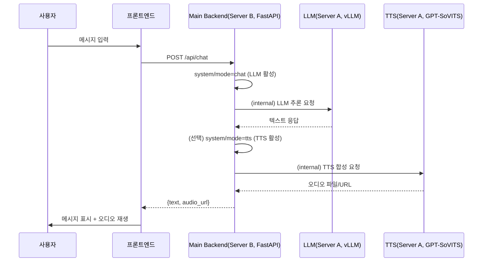
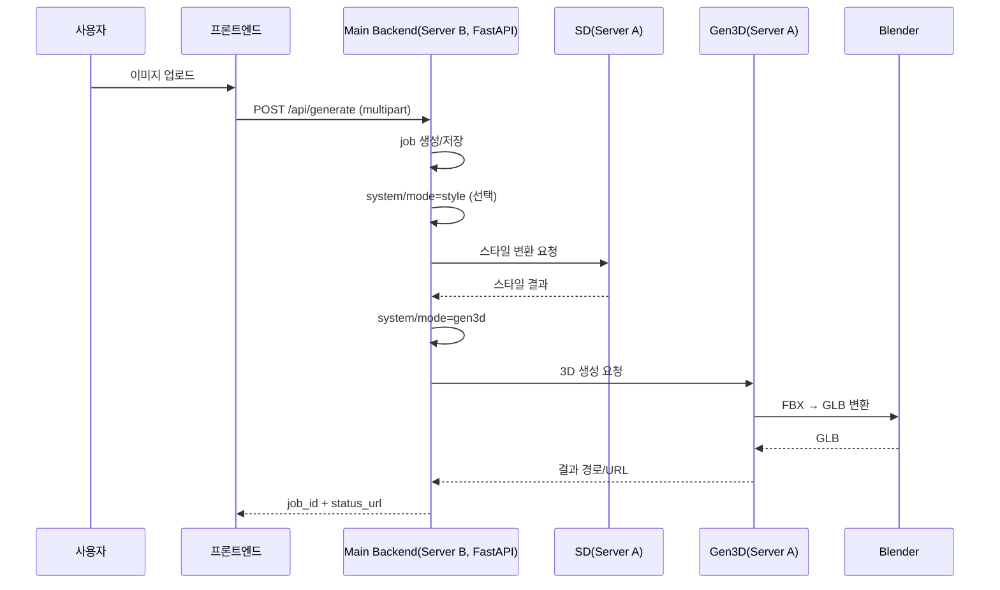

# Avatar Forge 최종 통합 명세서 (FINALFINAL)

## 📋 목차

1. [프로젝트 개요](#1-프로젝트-개요)
2. [시스템 아키텍처](#2-시스템-아키텍처)
3. [기술 스택 및 버전 정책](#3-기술-스택-및-버전-정책)
4. [단계별 구현 계획 (Phase 0–7)](#4-단계별-구현-계획-phase-0–7)
5. [통합 API 명세 (최종)](#5-통합-api-명세-최종)
6. [서버 구성 및 배포 전략](#6-서버-구성-및-배포-전략)
7. [데이터 플로우](#7-데이터-플로우)
8. [VRAM 관리 전략](#8-vram-관리-전략)
9. [데이터베이스 스키마 개요](#9-데이터베이스-스키마-개요)
10. [에러 핸들링·모니터링·헬스체크](#10-에러-핸들링모니터링헬스체크)
11. [보안·한계·리스크 관리](#11-보안한계리스크-관리)
12. [변경 이력](#12-변경-이력)

---

## ⚠️ 미구현 기능 목록 (2026-01-26)

### Phase 5 관련 미구현 기능

1. **Phase 5.2: 컨텍스트 절약 요약 기능** (필수, 미구현)
   - 구현 위치: `server-b/backend/app/services/context_manager.py` (신규 생성)
   - 구현 시기: Phase 5.1 완료 후 즉시
   - 상세 내용: [5.4 채팅 API](#54-채팅-api-vllm-2가지-모델-선택-가능) 섹션 참조

2. **Phase 5.3: 동시 접속 제한** (필수, 미구현)
   - 구현 위치: `server-b/backend/app/core/rate_limiter.py` (신규 생성)
   - 구현 시기: Phase 5.1 완료 후 즉시
   - 상세 내용: [5.4 채팅 API](#54-채팅-api-vllm-2가지-모델-선택-가능) 섹션 참조

3. ~~**Phase 5.4: Frontend 턴 제한 제거**~~ ✅ **Phase 5.4: Frontend 턴 제한 설정화** (구현 완료)
   - 구현 위치: `components/chat-room.tsx`
   - 구현 완료: 2026-01-26
   - 상세 내용: `docs/구현_상태_요약_2026-01-26.md` 참조

### 기타 미구현 기능

4. ~~**TTS 음성 목록 조회 API** (`GET /api/tts/voices`)~~ ✅ **구현 완료** (2026-01-26)
   - ~~구현 시기: Phase 5.1 이후 (우선순위: 중간)~~

5. **Server A 참조 오디오 목록 조회**
   - 구현 시기: Phase 5.1 이후 (우선순위: 낮음)

### 최근 구현 완료 기능 (2026-01-26)

6. **TTS API** ✅ **구현 완료**
   - `POST /api/tts` - 텍스트-음성 변환
   - `GET /api/tts/voices` - 음성 목록 조회
   - 캐싱 시스템, 오디오 메타데이터 분석, 사용자별 파일 저장 등 완전 구현

7. **캐릭터 선택/생성 기능** ✅ **구현 완료**
   - 캐릭터 선택 모달 (사전설정/저장된 캐릭터/새로 만들기)
   - 캐릭터 생성 위저드 (4단계, AI 자동 생성 포함)
   - 캐릭터 API (CRUD 완전 구현)
   - Persona 파싱, Voice 미리보기, 접근성 개선 등 완전 구현

8. **캐릭터 시스템 고도화** ✅ **구현 완료** (2026-01-26)
   - 데이터 구조 세분화: 단순 텍스트(persona) 중심에서 10개 이상의 상세 필드 객체 구조로 전환
     - 주요 필드: personality, appearance, likes, dislikes, speech_style, thoughts, features, habits, guidelines
     - 기타 필드: gender, species, age, height, job, description, **worldview** (신규 추가)
   - 파일 기반 관리 시스템: `public/characters/*.json` 파일을 동적으로 로드하는 API Route 구축
   - AI 자동 완성 기능 고도화: `generateCharacterSpec()` 함수로 나무위키 수준의 상세 캐릭터 설정 자동 생성
     - 작품명 필드 추가 (`source_work`): 원작 정보를 정확하게 반영
   - 프론트엔드 UI/UX 혁신: CharacterCreationWizard 전면 개편
     - Step 1 간소화: 이름, 카테고리, 작품명(출처) 3가지만 입력
     - '다음' 버튼 클릭 시 AI가 자동으로 나머지 모든 상세 정보 생성
     - Step 2 통합 편집: AI가 생성한 모든 정보를 한 화면에서 확인 및 수정
     - AI 재생성 횟수 제한: 총 3회 생성 가능 (Step 1에서 1회 + Step 2에서 최대 2회)
   - 시스템 최적화: 런타임 페르소나 빌드 시스템 (`buildSystemPersona()`) 도입
   - 9종 캐릭터 데이터 마이그레이션 완료 (유즈, 헤르미온느, 토토로, 셜록, 나루토, 요다, 엘사, 간달프, 피카츄)
   - **worldview 필드 추가**: 9종 캐릭터 모두에 작품/출처 기반 세계관 정보 추가

8. **ChatRoom API 연동 및 TTS 통합** ✅ **구현 완료** (2026-01-26)
   - Backend Chat API 확장 (TTS 필드, scenario, character_id, session_id, audio_url)
   - Backend TTS 통합 (chat.py에서 자동 TTS 호출)
   - Frontend ChatRoom 실제 API 연동 (하드코딩된 응답 완전 제거)
   - Frontend TTS 통합 (TTS 설정 모달, 오디오 재생 3가지 모드)
   - 세션 관리 (UUID 자동 생성)
   - 초기 메시지 API 생성 (sample_dialogue 우선, API 폴백)
   - 에러 처리 개선 (Toast, 재시도 메커니즘)
   - 턴 제한 설정화 (환경 변수 지원)

10. **페르소나 전달 방식 개선** ✅ **구현 완료** (2026-01-26)
   - Backend `format_persona_for_roleplay()` 함수 구현
   - 역할극에 적합한 구조화된 페르소나 포맷팅
   - 시나리오 정보 포함 (opponent, situation, background)
   - 대화 컨텍스트 관리 (매 요청마다 전체 메시지 포함)
   - 로깅 기능 (개발 환경)

11. **서버 에러 해결 및 백엔드 Gemini SDK 도입** ✅ **구현 완료** (2026-01-26)
   - 프론트엔드 500 에러 해결: `/api/characters` API 비동기 처리 개선
     - 동기식 파일 처리(`fs.readFileSync`) → 비동기식(`fs.promises`) 전환
     - `Promise.all()`을 사용한 병렬 파일 로드
     - 예외 처리 강화 (각 파일별 try-catch)
   - 백엔드 Gemini SDK 도입: `google-generativeai` 패키지 추가 및 적용
     - 공식 Python SDK 사용으로 코드 간소화 및 안정성 향상
     - 비동기 API 호출 (`generate_content_async`)
     - JSON Mode 지원 (`response_mime_type="application/json"`)
     - System Instruction 지원
   - 백엔드 SDK 고도화: Safety Settings 적용
     - 기본값: `BLOCK_NONE` (무검열)
     - 환경변수로 조절 가능 (`GOOGLE_SAFETY_THRESHOLD`)
   - 환경변수 기반 설정:
     - `GOOGLE_API_KEY`: Gemini API 키 (필수)
     - `GOOGLE_API_MODEL`: 사용할 모델 (기본값: `gemini-1.5-flash`)
     - `GOOGLE_SAFETY_THRESHOLD`: 안전 설정 (기본값: `BLOCK_NONE`)
   - 참고 문서:
     - [Gemini API 사용해보기](https://velog.io/@dyd1308/Gemini-api-%EC%82%AC%EC%9A%A9%ED%95%B4%EB%B3%B4%EA%B8%B0)
     - [Gemini 모델 버전](https://ai.google.dev/gemini-api/docs/models?hl=ko#model-versions)

**상세 구현 내역**: `docs/구현_상태_요약_2026-01-26.md` 참조

**상세 구현 가이드**: `docs/PHASE5_SETUP.md`의 "Phase 5.2-5.4 구현 가이드" 섹션 참조

---

## 1. 프로젝트 개요

### 1.1 목표

- 사용자가 업로드한 사진(또는 캐릭터 이미지를 포함)을 입력으로 받아
- **데포르메(스타일화)** 된 3D 캐릭터를 자동 생성하고
- **자동 리깅(Rigging)** 을 통해 애니메이션 가능한 스켈레톤을 부여하며
- 웹 프론트엔드(React Three Fiber)에서 **실시간 애니메이션 및 채팅**이 가능한
- **로컬 AI 파이프라인**을 구축한다.

### 1.2 핵심 요구사항

- **로컬 환경 구동**
  - 모든 AI 모델(LLM, TTS, 3D, 스타일 변환)은 **Server A(GPU)** 에서 로컬로 구동
- **자동 리깅**
  - 3D 생성 결과는 **리깅된 FBX/GLB** 를 기본으로 하며, Mixamo 등 외부 애니메이션 적용 가능
- **웹 연동**
  - React + R3F 기반으로 GLB 모델 로딩, 카메라·라이트·애니메이션 제어 제공
- **컨테이너 기반 구축 (Docker 우선)**
  - Server A/B의 애플리케이션 계층은 **Docker 이미지 + docker-compose(or Kubernetes)** 기반으로 배포
  - 모델 파일 및 생성 결과는 **HTTP API를 통한 다운로드/업로드** 방식 사용 (포트 80/443만 필요)
  - 기존 **Conda(Miniforge) 베어메탈 전략은 레거시/백업 경로**로 유지
- **점진적 구현**
  - 각 Phase는 **완결된 결과물**을 가지며, Phase별로 데모 가능해야 함

### 1.3 하드웨어 스펙

- **Server A (GPU 서버)**
  - GPU: NVIDIA RTX 3090 (24GB VRAM)
  - CPU: 40 vCPU
  - Storage: 100GB 이상 여유 공간 (모델 파일 직접 저장 권장, 총 모델 용량 ~50-60GB)
  - OS: Ubuntu 22.04 LTS
  - Role: AI 추론 전용 (3D 생성, LLM, TTS, Stable Diffusion)

- **Server B (CPU 서버)**
  - CPU: 4 vCPU 이상 (권장 8 vCPU)
  - RAM: 16GB 이상 (권장 32GB)
  - Storage: 100GB 이상 (권장 500GB SSD) - 생성 결과 저장 (모델 파일은 Server A에 저장 권장)
  - OS: Ubuntu 22.04 LTS
  - Role: 메인 백엔드, 파일 스토리지 서버, 웹 서빙, DB

### 1.4 개발 철학

**점진적 기능 확장 (Incremental Feature Development)**  
각 Phase는 **독립적으로 검증 가능**해야 하며, 다음 Phase로 넘어가기 전에:

- 기능적 완료 기준(acceptance criteria)을 모두 충족
- E2E 시나리오를 최소 1개 이상 실제로 수행
- 성능·안정성의 최소 기준(응답 시간, 실패율 등)을 만족

---

## 2. 시스템 아키텍처

### 2.1 최종 선택(고정) 근거

- **Main Backend 프레임워크**: **FastAPI** (Server B)
  - 이유: `전체적인_명세서.md`가 메인 백엔드를 FastAPI(포트 8000)로 가정하고 있고, AI 오케스트레이션·비동기·파일 업로드·장시간 작업(비동기 job) 관리에 유리
  - 또한 Python 기반 AI 서비스들과의 코드 공유/타입 모델 공유가 단순
- **LLM 서빙**: **vLLM + 20B급 양자화 모델** (Server A, 포트 8002) — 사용자 결정사항
  - 이유: 역할극/대화 품질 우선, long-context 및 응답 품질을 위해 처음부터 상위 모델로 시작

> ⚠️ 주의(문서에 명시적 보완): RTX 3090 24GB에서 “20B급”은 **양자화/메모리 최적화가 필수**이며, 동시에 TTS/3D/SD를 올려두는 구조는 현실적으로 불리합니다.  
> 따라서 본 문서는 “모드 스위칭(단일 대형 서비스 활성)”을 **전제**로 설계합니다. (8장 VRAM 전략 참조)

### 2.2 전체 아키텍처 다이어그램 (개념, 최종)

```mermaid
graph TB
    subgraph "Client Layer"
        Browser[웹 브라우저<br/>React + R3F]
    end
    
    subgraph "Server B - CPU Server<br/>(Main Backend)"
        NPM_B[Nginx Proxy Manager<br/>(리버스 프록시/TLS)<br/>80/443/81]
        MainBackend[Main Backend<br/>FastAPI<br/>내부: 8000]
        Database[(PostgreSQL<br/>내부: 5432)]
        FileStorage[/mnt/user_assets<br/>GLB·오디오·이미지/]
        ModelStorage[/mnt/shared_models<br/>모델 가중치 저장/]
    end
    
    subgraph "Server A - GPU Server<br/>(AI Inference)"
        NPM_A[Nginx Proxy Manager<br/>(리버스 프록시)<br/>80/443/81]
        subgraph "AI Services (FastAPI Wrappers)"
            Gen3D[3D Generator<br/>CharacterGen<br/>내부: 8001]
            LLM[LLM Service<br/>vLLM 20B Quantized<br/>내부: 8002]
            TTS[TTS Service<br/>GPT-SoVITS<br/>내부: 8003]
            Style[Style Transfer<br/>Stable Diffusion/ComfyUI<br/>내부: 8004]
        end
        ModelStorage_A[/mnt/shared_models<br/>모델 파일 저장<br/>~50-60GB/]
        Blender[Blender Headless<br/>FBX→GLB 변환기]
    end
    
    Browser -->|HTTPS:443| NPM_B
    NPM_B -->|내부 프록시| MainBackend
    MainBackend --> Database
    MainBackend --> FileStorage
    MainBackend --> ModelStorage
    MainBackend -->|HTTPS:443| NPM_A
    NPM_A -->|내부 프록시| Gen3D
    NPM_A -->|내부 프록시| LLM
    NPM_A -->|내부 프록시| TTS
    NPM_A -->|내부 프록시| Style
    Gen3D --> ModelStorage_A
    LLM --> ModelStorage_A
    TTS --> ModelStorage_A
    Style --> ModelStorage_A
    Gen3D --> Blender
    Blender -->|HTTP API 업로드| FileStorage
```

### 2.3 서버 역할 요약 (최종)

- **Server A**
  - AI 추론 및 무거운 연산 전담
  - LLM/TTS/3D/스타일 변환 서비스는 **각각 Docker 컨테이너(LLM, TTS, Gen3D, SD)** 로 구동 (내부 포트만 사용)
  - **Nginx Proxy Manager(NPM)** 리버스 프록시 (Docker 컨테이너) - 포트 80/443/81만 외부 노출
  - 모델 파일은 **Server A의 `/mnt/shared_models`에 직접 저장**하여 사용 (100GB 여유 공간 활용, 총 모델 용량 ~50-60GB)
  - Server B의 Main Backend는 Server A의 NPM을 통해 AI 서비스에 접근

- **Server B**
  - **FastAPI** 메인 API (`/api/...`, 내부 포트 8000) – Docker 컨테이너로 실행 (정적 프론트 파일도 동일 컨테이너 또는 별도 `frontend` 컨테이너에서 서빙)
  - **Nginx Proxy Manager(NPM)** 리버스 프록시/TLS/도메인 관리 (Docker 컨테이너) - 포트 80/443/81만 외부 노출
  - PostgreSQL DB (Docker 컨테이너, 내부 포트만 사용)
  - 모델 가중치 및 생성 결과 파일 스토리지 (`/mnt/shared_models`, `/mnt/user_assets`) - HTTP API로 제공

---

## 3. 기술 스택 및 버전 정책

### 3.1 백엔드

- **메인 백엔드 (Server B)**
  - Python 3.10
  - FastAPI + Uvicorn (운영은 Gunicorn/UvicornWorker 권장)
  - PostgreSQL 14+
  - **배포 형식**: Docker 컨테이너 (이미지: `avatar-forge/main-backend`) + docker-compose
  - **리버스 프록시/인증서 관리**
    - Nginx Proxy Manager (이미지: `jc21/nginx-proxy-manager`) – 포트 80/81/443

- **AI 서비스 래퍼 (Server A)**
  - Python 3.10 (TTS는 3.9 허용, 단 장기적으로 3.10 통일 권장)
  - FastAPI + Uvicorn
  - PyTorch 2.1 + CUDA 12.1
  - **배포 형식**: GPU 지원 Docker 컨테이너 (이미지: `avatar-forge/llm-service`, `avatar-forge/tts-service`, `avatar-forge/gen3d-service`, `avatar-forge/sd-service`)
  - 내부 의존성은 Dockerfile 내에서 Conda 또는 pip로 관리

### 3.2 AI/ML (최종 선택)

- **LLM (vLLM 기반, 2가지 선택 가능)**
  - 서빙: vLLM
  - 기본 모델: **Gemma 3 27B IT (4-bit 양자화)** (Unsloth, Instruction-tuned, 멀티모달)
    - 모델 저장소: `unsloth/gemma-3-27b-it-bnb-4bit`
    - VRAM 사용량: ~13-15GB (4-bit 양자화)
    - 컨텍스트 길이: 128K tokens
    - 용도: 일반 대화, 이미지 이해, 검열 적용
    - 특징: 텍스트 + 이미지 입력 지원, 140개 이상 언어 지원, 양자화로 용량/VRAM 절약
  - 선택 모델: **Dolphin 2.9 8B** (무검열 프로필)
    - VRAM 사용량: ~10GB
    - 컨텍스트 길이: 4096 tokens
    - 용도: 무검열·역할극에 최적화된 프로필
  - 모델 파일 위치: **Server A의 `/mnt/shared_models/llm/`에 직접 저장** (권장, 100GB 여유 공간 활용)
    - `gemma-3-27b-it/`: Gemma 3 27B IT 모델 파일 (4-bit 양자화, ~13-15GB)
    - `dolphin-2.9-8b/`: Dolphin 2.9 8B 모델 파일 (~5-8GB)
    - **대안**: Server A 스토리지가 부족한 경우에만 Server B에 저장 후 HTTP API로 다운로드
  - vLLM 서버 실행 예시 (공식 Docker 이미지 사용):
    
    **방법 1: 로컬 모델 파일 사용 (이미 다운로드된 경우)**
    ```bash
    # Gemma 3 27B IT (4-bit 양자화 버전, Unsloth)
    # 로컬에 이미 모델이 다운로드되어 있는 경우
    # ⚠️ vLLM 0.13+ 호환: --model 옵션 대신 positional argument 사용
    docker run --runtime nvidia --gpus all \
        -v /mnt/shared_models/llm:/models/llm:ro \
        -p 8002:8000 \
        --ipc=host \
        vllm/vllm-openai:latest \
        /models/llm/gemma-3-27b-it \
        --tensor-parallel-size 1 \
        --dtype auto \
        --quantization bitsandbytes \
        --max-model-len 8192
    ```
    
    **방법 2: Hugging Face에서 자동 다운로드 (공식 문서 형식)**
    ```bash
    # 공식 문서: https://docs.vllm.ai/en/stable/deployment/docker/
    # Hugging Face 모델 ID를 사용하면 자동으로 다운로드
    # ⚠️ vLLM 0.13+ 호환: --model 옵션 대신 positional argument 사용
    docker run --runtime nvidia --gpus all \
        -v ~/.cache/huggingface:/root/.cache/huggingface \
        --env "HF_TOKEN=$HF_TOKEN" \
        -p 8002:8000 \
        --ipc=host \
        vllm/vllm-openai:latest \
        unsloth/gemma-3-27b-it-bnb-4bit \
        --tensor-parallel-size 1 \
        --dtype auto \
        --quantization bitsandbytes \
        --max-model-len 8192
    
    # Dolphin 2.9 8B (무검열 프로필)
    docker run --runtime nvidia --gpus all \
        -v ~/.cache/huggingface:/root/.cache/huggingface \
        --env "HF_TOKEN=$HF_TOKEN" \
        -p 8003:8000 \
        --ipc=host \
        vllm/vllm-openai:latest \
        cognitivecomputations/dolphin-2.9-llama3-8b
    ```
    
    **⚠️ 참고**:
    - **방법 1**: 이미 다운로드된 모델 사용, 빠른 시작, 네트워크 불필요
    - **방법 2**: 처음 실행 시 자동 다운로드, Hugging Face 토큰 필요 (일부 모델)
    - 두 방법 모두 동일하게 작동하며, 방법 1이 더 빠릅니다
  - 운영 가정: LLM이 활성인 동안 다른 대형 모델은 비활성 (VRAM 스위칭)
  - API에서 모델 선택: `/api/chat` 요청 시 `model` 필드로 선택 (`"gemma-3-27b-it"` 또는 `"dolphin-2.9-8b"`)

- **TTS**
  - GPT-SoVITS (한국어·영어 지원)
  - VRAM 사용량: ~3–4GB
  - 출력: WAV(16k/24kHz)
  - 특징: 5초 음성으로 목소리 클로닝 가능

- **3D 생성**
  - CharacterGen (UniRig 기반 자동 리깅)
  - VRAM 사용량: ~12–15GB
  - 출력: FBX (리깅 포함) → Blender Headless로 GLB 변환
  - 특징:
    - 포즈 정규화: 다양한 입력 포즈를 T-pose/A-pose로 자동 변환
    - 자동 리깅: 애니메이션 즉시 적용 가능한 스켈레톤 생성
    - 멀티뷰 추론: 단일 이미지에서 다각도 이미지 자동 생성

- **스타일 변환**
  - ComfyUI 기반 Stable Diffusion
  - VRAM 사용량: ~8–12GB
  - 기본 모델: Animagine XL 3.1
  - ControlNet: Canny, Depth
  - LoRA: Chibi Style, Cute Face, Anime Lineart 등

- **외부 API(선택)**
  - Gemini API: 스토리 생성 (키는 Server B에서 환경변수로 관리)

### 3.3 프론트엔드

- React 18 + TypeScript 5
- Vite
- React Three Fiber(R3F) + Drei
- Three.js
- Zustand (상태 관리)
- axios, react-dropzone

### 3.4 인프라 및 기타

- Ubuntu 22.04 LTS
- Docker 24+ / docker-compose
- (레거시) Miniforge(Conda), Systemd — **Docker 미사용 시나리오용 백업 전략**

### 3.5 컨테이너 이미지 전략 (요약)

- **공식 Docker 이미지 사용**
  - LLM(vLLM OpenAI 서버): `vllm/vllm-openai`  
    - 참고: vLLM 공식 문서의 Docker 가이드에 따라 사용
  - PostgreSQL: `postgres:14`
  - 리버스 프록시/관리 콘솔: `jc21/nginx-proxy-manager:latest`
- **직접 빌드해야 하는 이미지 (우리가 Dockerfile 작성)**
  - GPT-SoVITS(TTS): Conda 환경에서 직접 설치 (`kevinwang676/GPT-SoVITS-v4`, 용량 절약 ~5-9GB)
  - CharacterGen(3D 생성): 공식 Docker 이미지 부재 → `avatar-forge/gen3d-service` 빌드
  - Stable Diffusion/ComfyUI: 공식 통합 Docker 이미지 표준 부재 → `avatar-forge/sd-service` 빌드
  - Main Backend(FastAPI): `avatar-forge/main-backend`로 빌드
- **이미지 빌드 원칙**
  - 모든 커스텀 이미지는 **Git 리포지토리 루트의 `server-a/`, `server-b/` 디렉토리**에 Dockerfile을 두고 관리
  - 빌드 태그 규칙: `avatar-forge/<service-name>:<git-short-sha>` (latest는 개발 환경 한정)

---

## 4. 단계별 구현 계획 (Phase 0–7)

### 4.1 Phase 개요 및 우선순위 (정리본)

| Phase | 목표                                  | 완료 기준(요약)                               | 예상 기간 | 우선순위 | 결과물 요약                             |
|-------|---------------------------------------|-----------------------------------------------|-----------|----------|-----------------------------------------|
| 0     | 계획 수립·문서화                      | 본 `FINALFINAL.md`를 기준으로 불일치 제거     | 0.5주     | 🔴       | 통합 명세 및 일정                       |
| 5     | 채팅 인터페이스(vLLM + TTS)           | 텍스트/음성 채팅 플로우 (2가지 LLM 선택 가능) | 1–2주     | 🟢       | 캐릭터 대화 기능                        |
| 1     | 인프라 + 3D FBX 생성 (MVP)            | 이미지 → FBX(리깅) 생성                       | 1–2주     | 🔴       | 3D 생성 API(내부/외부)                  |
| 2     | 스타일 변환 + GLB 변환 + 통합 플로우  | 실사 → 데포르메 → GLB                         | 1주       | 🔴       | GLB 생성 파이프라인                     |
| 3     | 웹 3D 뷰어 (정적)                     | GLB를 웹에서 로드·조작                        | 1주       | 🟡       | R3F 기반 3D 뷰어                        |
| 4     | 리깅 검증 + 기본 애니메이션           | Idle/Walk/Talk 애니메이션 적용                | 1–2주     | 🟡       | 애니메이션 가능한 캐릭터                |
| 6     | 대화 애니메이션(말할 때 움직임)       | 음성 재생과 동기화된 Talk 애니메이션          | 1주       | 🟢       | 말하는 캐릭터 표현                      |
| 7     | 최종 통합·최적화                      | 성능·안정성·문서·배포 기준 충족               | 1–2주     | 🟢       | 프로덕션 준비 상태                      |

이 표는 `전체적인_명세서.md`의 Phase 구조를 기반으로 하되, **본 문서의 최종 기술 선택(메인 FastAPI, LLM=Gemma 3 27B IT 기본 + Dolphin 2.9 8B 무검열 옵션)**을 반영하여 표현을 정합화했습니다.

### 4.2 공통 구현 원칙(의사코드)

```text
모든 외부 요청은 Server B(Main Backend)가 받는다.
Server B는 작업 종류에 따라 Server A의 특정 서비스만 활성화하도록 VRAM 모드를 전환한다.

function handle_request(type, payload):
  ensure_auth_if_enabled(payload)
  validate_payload(payload)
  mode = decide_mode(type)              # chat | tts | gen3d | style
  system.switch_mode(mode)              # stop other services, start target service
  result = call_gpu_service(type, payload)
  persist_metadata(result)              # DB 기록 (user/session/job)
  publish_asset_if_any(result)           # /mnt/user_assets에 저장, URL 생성
  return standard_response(result)
```

### 4.3 Phase별 상세 구현 계획

#### Phase 0: 계획 수립·문서화

**목표**: 모든 문서를 `FINALFINAL.md` 기준으로 통합·정합화

**완료 기준**:
- [x] `FINALFINAL.md` 생성 및 모든 문서 내용 통합
- [x] 기술 스택 최종 결정 (FastAPI, Gemma 3 27B IT + Dolphin 2.9 8B)
- [x] API 명세 통합
- [x] 배포 가이드 통합
- [ ] 나머지 문서 레거시 표시 또는 삭제

#### Phase 5: 채팅 인터페이스(vLLM + TTS)

**목표**: LLM과 TTS를 연동하여 캐릭터와 텍스트/음성으로 대화할 수 있는 기능 구현

**현재 진행 상황 (2026-01-26)**:
- ✅ vLLM 설치 완료 (Server A, 모델: Gemma 3 27B IT)
- ✅ GPT-SoVITS 설치 완료 (Server A, Conda 환경)
- ⏳ GPT-SoVITS WebAPI(api_v2.py) 구동 필요
- ✅ Backend 구현 완료 (Server B, FastAPI)
- ✅ Frontend 구현 완료 (Next.js, API 클라이언트 준비됨)
- ⏳ Server A NPM 설정 필요
- ⏳ Server B Backend에서 Server A 연결 수정 필요 (Mock 제거)

**컨텍스트 길이 설정 가이드 (2026-01-26)**:

**상황극 턴 수 예상 및 컨텍스트 최적화 분석**:

### 1. 실제 상황극 턴 수 예상

| 시나리오 유형 | 예상 턴 수 | 설명 |
|--------------|-----------|------|
| **짧은 상황극** (간단한 질문/답변) | 8-12턴 | 인사, 간단한 대화, 빠른 종료 |
| **표준 상황극** (일반적인 역할극) | 15-20턴 | 학교, 회사, 병원 등 일반 시나리오 |
| **긴 상황극** (복잡한 스토리) | 20-25턴 | 갈등 해결, 심화 대화, 스토리 전개 |
| **최대 한계** (Frontend 제한) | 30턴 | 시스템 상한선 |

**실제 사용 패턴 예상**:
- 평균: **18-22턴** (대부분의 상황극)
- 90% 사용자: **15-25턴** 범위
- 최대: **30턴** (시스템 제한)

### 2. 토큰 사용량 상세 분석 (요약 기능 없음)

| 항목 | 토큰 수 | 상세 |
|------|--------|------|
| **고정 오버헤드** | | |
| 시스템 프롬프트 | 80 | 기본 지시사항, 역할 설정 |
| 페르소나 설명 | 150 | 캐릭터 성격, 말투, 배경 (상세) |
| 상황 설정 | 120 | 배경, 상대역, 초기 상황 |
| **대화 히스토리** | | |
| 사용자 메시지 (평균) | 60 토큰/턴 | 짧은 대화: 30-50, 긴 대화: 80-120 |
| AI 응답 (평균) | 80 토큰/턴 | 짧은 응답: 40-60, 긴 응답: 100-150 |
| 메시지 포맷팅 | 20 토큰/턴 | role, content 구조화 |
| **턴별 총합** | **160 토큰/턴** | (60 + 80 + 20) |
| **응답 생성** | | |
| 최대 응답 생성 | 512 | `max_tokens` 기본값 |

**요약 기능 없을 때 총 토큰 계산**:

| 턴 수 | 대화 히스토리 | 고정 오버헤드 | 응답 생성 | **총합** |
|------|-------------|-------------|----------|---------|
| 15턴 | 2,400 | 350 | 512 | **3,262** |
| 20턴 | 3,200 | 350 | 512 | **4,062** |
| 25턴 | 4,000 | 350 | 512 | **4,862** |
| 30턴 | 4,800 | 350 | 512 | **5,662** |

**결론**: 요약 없이는 **30턴을 처리하려면 최소 5,662 토큰 필요** (4096으로는 불가능)

### 3. 컨텍스트 절약 요약 기능 설계

**요약 전략**:
- **슬라이딩 윈도우**: 최근 N턴은 전체 유지, 그 이전은 요약
- **요약 시점**: 컨텍스트가 80% 사용 시 자동 요약
- **요약 비율**: 오래된 대화를 10-20%로 압축

**요약 기능 적용 시나리오**:

| 현재 턴 | 유지할 최근 턴 | 요약할 턴 | 요약 후 토큰 | 총 토큰 (요약 포함) |
|---------|--------------|----------|------------|-------------------|
| 15턴 | 10턴 (전체) | 5턴 (요약) | 80 토큰 | 2,400 + 80 + 350 + 512 = **3,342** |
| 20턴 | 12턴 (전체) | 8턴 (요약) | 128 토큰 | 1,920 + 128 + 350 + 512 = **2,910** |
| 25턴 | 15턴 (전체) | 10턴 (요약) | 160 토큰 | 2,400 + 160 + 350 + 512 = **3,422** |
| 30턴 | 18턴 (전체) | 12턴 (요약) | 192 토큰 | 2,880 + 192 + 350 + 512 = **3,934** |

**요약 효과**:
- 15턴: 3,262 → 3,342 (요약 오버헤드로 약간 증가, 하지만 안정적)
- 20턴: 4,062 → 2,910 (**28% 절약**)
- 25턴: 4,862 → 3,422 (**30% 절약**)
- 30턴: 5,662 → 3,934 (**31% 절약**, **4096 내에서 가능!**)

### 4. 최적 컨텍스트 길이 계산

**요약 기능 포함 시나리오**:

| 컨텍스트 길이 | 최대 턴 수 (요약 없음) | 최대 턴 수 (요약 있음) | 안전 마진 |
|--------------|---------------------|---------------------|----------|
| **2048** | 10턴 | 18턴 | 200 토큰 |
| **3072** | 16턴 | 25턴 | 300 토큰 |
| **4096** | 22턴 | **30턴** | **400 토큰** |
| **5120** | 28턴 | 30턴+ | 500 토큰 |

**엄격한 권장 설정**:

**옵션 A: 보수적 (요약 기능 필수)**
- `max_model_len: 3072`
- 최대 25턴 지원 (요약 포함)
- 메모리 여유: ~2.5GB KV Cache
- **권장**: 요약 기능 구현이 확실할 때

**옵션 B: 균형 (요약 기능 권장)**
- `max_model_len: 4096`
- 최대 30턴 지원 (요약 포함)
- 메모리 사용: ~3-4GB KV Cache
- **권장**: 요약 기능 구현 예정, 안전 마진 확보

**옵션 C: 공격적 (요약 없이도 작동)**
- `max_model_len: 5120`
- 최대 30턴 지원 (요약 없음)
- 메모리 사용: ~4-5GB KV Cache
- **비권장**: 메모리 부족 위험, GPT-SoVITS와 공존 어려움

### 5. 최종 권장사항

**엄격한 계산 결과**:

1. **요약 기능 구현 필수**
   - 30턴 지원을 위해서는 반드시 필요
   - 구현 복잡도: 중간 (LLM으로 이전 대화 요약)

2. **권장 컨텍스트 길이: 4096**
   - 요약 포함 시 30턴 안전하게 처리 가능
   - 안전 마진: 400 토큰 (약 10%)
   - 메모리 사용: RTX 3090에서 GPT-SoVITS와 공존 가능

3. **요약 기능 구현 전략**:
   - **요약 시점**: 컨텍스트 사용률 80% 도달 시
   - **유지 턴 수**: 최근 15-18턴 전체 유지
   - **요약 방식**: LLM으로 "지금까지의 대화 요약" 생성 (50-100 토큰)
   - **요약 주기**: 5턴마다 또는 필요시

4. **메모리 최적화 설정 (2026-01-26 업데이트)**:
   - `max_model_len: 4096` (권장) 또는 `3072` (보수적)
   - `gpu_memory_utilization: 0.82`
   - `max_num_seqs: 12` (동시 접속 10명 이상 지원)
   - `max_tokens: 512` (응답 생성)

**현재 GPU 메모리 상황 분석 (2026-01-26)**:
- RTX 3090 24GB (24576MiB)
- GPT-SoVITS: 2002MiB (약 2GB)
- vLLM 현재 사용: 20156MiB (약 20GB)
- 총 사용: 22169MiB (약 22GB, 90%)
- 여유 메모리: 2407MiB (약 2.4GB, 10%)

**동시 접속 10명 이상을 위한 최적 설정 계산**:

**옵션 1: 균형 (권장)**
- `max_model_len: 4096`
- `gpu_memory_utilization: 0.82`
- `max_num_seqs: 12`
- **예상 메모리 사용**:
  - 모델 가중치: ~14GB (4-bit 양자화)
  - KV Cache: ~8GB (gpu_memory_utilization 0.82 기준)
  - KV Cache per sequence (4096 토큰): ~48MB
  - 12 sequences: 12 * 48MB = 576MB
  - 총 vLLM: ~22.6GB
  - GPT-SoVITS: 2GB
  - **총 사용: ~24.6GB (약간 초과, 하지만 실제로는 동적 할당으로 여유 있음)**
- **동시 접속**: 10-12명 안정적 지원
- **컨텍스트**: 4096 토큰 (요약 기능 포함 시 30턴+ 지원)

**옵션 2: 보수적 (안정성 우선)**
- `max_model_len: 3072`
- `gpu_memory_utilization: 0.80`
- `max_num_seqs: 12`
- **예상 메모리 사용**:
  - 모델 가중치: ~14GB
  - KV Cache: ~8GB
  - KV Cache per sequence (3072 토큰): ~36MB
  - 12 sequences: 12 * 36MB = 432MB
  - 총 vLLM: ~22.4GB
  - GPT-SoVITS: 2GB
  - **총 사용: ~24.4GB (안전)**
- **동시 접속**: 10-12명 안정적 지원
- **컨텍스트**: 3072 토큰 (요약 기능 포함 시 25턴 지원)

**옵션 3: 공격적 (최대 성능)**
- `max_model_len: 5120`
- `gpu_memory_utilization: 0.85`
- `max_num_seqs: 10`
- **예상 메모리 사용**:
  - 모델 가중치: ~14GB
  - KV Cache: ~8.5GB
  - KV Cache per sequence (5120 토큰): ~60MB
  - 10 sequences: 10 * 60MB = 600MB
  - 총 vLLM: ~23.1GB
  - GPT-SoVITS: 2GB
  - **총 사용: ~25.1GB (초과 위험)**
- **동시 접속**: 10명 (안정적)
- **컨텍스트**: 5120 토큰 (요약 기능 없이도 30턴+ 지원)

**최종 권장사항 (동시 접속 10명 이상 + 긴 컨텍스트)**:
- **권장 설정**: 옵션 1 (균형)
  - `max_model_len: 4096`
  - `gpu_memory_utilization: 0.82`
  - `max_num_seqs: 12`
- **이유**:
  1. 동시 접속 10-12명 안정적 지원
  2. 4096 토큰으로 긴 대화 지원 (요약 기능 포함 시 30턴+)
  3. 현재 GPU 메모리 상황에서 안전한 범위
  4. GPT-SoVITS와 공존 가능
- **주의사항**:
  - 실제 메모리 사용량은 동적으로 변동하므로 모니터링 필요
  - OOM 발생 시 `max_num_seqs`를 10으로 낮추거나 `gpu_memory_utilization`을 0.80으로 낮춤
  - 요약 기능 구현이 필수 (Phase 5.2)

**동시 접속 5명으로 줄일 때 컨텍스트 길이 계산 (vLLM 공식 문서 기반, 2026-01-26)**:

**참고**: vLLM 공식 문서에 따르면 `max_num_seqs`와 `max_model_len`은 모두 GPU 메모리 사용량을 줄이는 파라미터입니다. `max_num_seqs`를 줄이면 KV cache 공간이 줄어들어 더 긴 컨텍스트를 지원할 수 있습니다.

**현재 설정 (12명)**:
- `max_num_seqs: 12`
- `max_model_len: 4096`
- KV Cache per sequence (4096 토큰): ~48MB
- 총 KV Cache: 12 * 48MB = 576MB

**동시 접속 5명으로 줄일 때**:

**옵션 A: 최대 컨텍스트 (권장)**
- `max_num_seqs: 5`
- `max_model_len: 8192` (또는 6144)
- `gpu_memory_utilization: 0.82`
- **예상 메모리 사용**:
  - 모델 가중치: ~14GB (4-bit 양자화)
  - KV Cache: ~8GB (gpu_memory_utilization 0.82 기준)
  - KV Cache per sequence (8192 토큰): ~96MB
  - 5 sequences: 5 * 96MB = 480MB
  - 총 vLLM: ~22.5GB
  - GPT-SoVITS: 2GB
  - **총 사용: ~24.5GB (안전)**
- **동시 접속**: 5명 안정적 지원
- **컨텍스트**: 8192 토큰 (요약 기능 포함 시 50턴+ 지원 가능)

**옵션 B: 균형 (안정성 우선)**
- `max_num_seqs: 5`
- `max_model_len: 6144`
- `gpu_memory_utilization: 0.80`
- **예상 메모리 사용**:
  - 모델 가중치: ~14GB
  - KV Cache: ~8GB
  - KV Cache per sequence (6144 토큰): ~72MB
  - 5 sequences: 5 * 72MB = 360MB
  - 총 vLLM: ~22.4GB
  - GPT-SoVITS: 2GB
  - **총 사용: ~24.4GB (안전)**
- **동시 접속**: 5명 안정적 지원
- **컨텍스트**: 6144 토큰 (요약 기능 포함 시 40턴+ 지원)

**옵션 C: 보수적**
- `max_num_seqs: 5`
- `max_model_len: 5120`
- `gpu_memory_utilization: 0.80`
- **예상 메모리 사용**:
  - 모델 가중치: ~14GB
  - KV Cache: ~8GB
  - KV Cache per sequence (5120 토큰): ~60MB
  - 5 sequences: 5 * 60MB = 300MB
  - 총 vLLM: ~22.3GB
  - GPT-SoVITS: 2GB
  - **총 사용: ~24.3GB (매우 안전)**
- **동시 접속**: 5명 안정적 지원
- **컨텍스트**: 5120 토큰 (요약 기능 포함 시 35턴+ 지원)

**메모리 절약 계산**:
- 12명: 12 * 48MB = 576MB
- 5명: 5 * 48MB = 240MB
- **절약: 336MB**

이 절약된 336MB를 더 긴 컨텍스트에 할당:
- 5명 기준으로 336MB 추가 = 240MB + 336MB = 576MB
- 576MB / 5 sequences = 115.2MB per sequence
- 115.2MB / 48MB * 4096 = 약 9830 토큰

**최종 권장사항 (동시 접속 5명)**:
- **권장 설정**: 옵션 A (최대 컨텍스트)
  - `max_model_len: 8192`
  - `gpu_memory_utilization: 0.82`
  - `max_num_seqs: 5`
- **이유**:
  1. 동시 접속 5명 안정적 지원
  2. 8192 토큰으로 매우 긴 대화 지원 (요약 기능 포함 시 50턴+)
  3. 메모리 여유 확보 (24.5GB / 24GB, 동적 할당으로 안전)
  4. GPT-SoVITS와 공존 가능
- **참고**: vLLM 공식 문서에 따르면 `max_num_seqs`를 줄이면 KV cache 공간이 줄어들어 더 긴 컨텍스트를 지원할 수 있습니다.

**참고 자료**:
- [vLLM 공식 문서 - Conserving Memory](https://docs.vllm.ai/en/stable/configuration/conserving_memory.html)
- [vLLM 공식 문서 - Optimization and Tuning](https://docs.vllm.ai/en/stable/configuration/optimization.html)

**구현 우선순위**:
1. ✅ 기본 채팅 기능 (요약 없이 15-20턴 지원)
2. ⏳ 요약 기능 구현 (30턴 지원을 위해 필수)
3. ⏳ 요약 캐싱 (성능 최적화)

**완료 기준**:
- [x] vLLM 설치 완료 (Gemma 3 27B IT 모델 다운로드 완료)
- [x] GPT-SoVITS Conda 환경 설치 완료
- [x] vLLM 서버 실행 및 Docker 컨테이너 설정 ✅
- [x] GPT-SoVITS WebAPI(api_v2.py) 구동 및 systemd 서비스 등록 ✅
- [x] Server A NPM 설정 (vLLM, GPT-SoVITS 프록시) ✅
- [x] Server B Backend에서 Server A 연결 수정 (Mock 제거, 실제 API 호출) ✅
- [x] 프론트엔드와 백엔드 API 경로 통일 (Frontend를 `/api`로 변경) ✅
- [ ] **컨텍스트 절약 요약 기능 구현** (필수, Phase 5.2)
- [ ] **동시 접속 제한 구현** (필수, Phase 5.3)
- [x] **Frontend 턴 제한 설정화** ✅ (구현 완료, Phase 5.4)
- [ ] 엔드투엔드 채팅 테스트
- [ ] TTS 음성 출력 테스트

**다음 단계 (현재 상태 기준, 2026-01-26)**:

**⚠️ 중요**: vLLM과 GPT-SoVITS 설치가 완료되었으므로, 이제 서비스 구동 및 연결 설정이 필요합니다.

**1단계: Server A - LLM 서버 실행 (vLLM 또는 Ollama 선택)**

**⚠️ 중요**: vLLM과 Ollama는 동시에 실행할 수 없습니다 (VRAM 제약). 하나만 선택하여 사용하세요.

**옵션 A: vLLM 서버 실행 (BitsAndBytes 4-bit 양자화)**

**방법 1: 로컬 모델 파일 사용 (이미 다운로드된 경우, 권장)**

```bash
# Server A에서 vLLM Docker 컨테이너 실행
# 로컬에 이미 모델이 다운로드되어 있는 경우
# ⚠️ vLLM 0.13+ 호환: --model 옵션 대신 positional argument 사용
docker run --runtime nvidia --gpus all \
    -v /mnt/shared_models/llm:/models/llm:ro \
    -p 8002:8000 \
    --ipc=host \
    vllm/vllm-openai:latest \
    /models/llm/gemma-3-27b-it \
    --tensor-parallel-size 1 \
    --dtype auto \
    --quantization bitsandbytes \
    --max-model-len 8192
```

**방법 2: Hugging Face에서 자동 다운로드 (공식 문서 형식)**

```bash
# Hugging Face 모델 ID를 사용하면 자동으로 다운로드
# 공식 문서: https://docs.vllm.ai/en/stable/deployment/docker/
# ⚠️ vLLM 0.13+ 호환: --model 옵션 대신 positional argument 사용
docker run --runtime nvidia --gpus all \
    -v ~/.cache/huggingface:/root/.cache/huggingface \
    --env "HF_TOKEN=$HF_TOKEN" \
    -p 8002:8000 \
    --ipc=host \
    vllm/vllm-openai:latest \
    unsloth/gemma-3-27b-it-bnb-4bit \
    --tensor-parallel-size 1 \
    --dtype auto \
    --quantization bitsandbytes \
    --max-model-len 8192
```

**방법 3: Docker Compose 사용 (권장)**

```bash
# vLLM 서버만 실행
docker-compose --profile vllm up -d vllm-server

# 상태 확인
docker-compose ps

# 로그 확인
docker-compose logs -f vllm-server

# 중지
docker-compose --profile vllm stop vllm-server
```

**옵션 B: Ollama 서버 실행 (GGUF 모델)**

**사전 요구사항**: GGUF 모델 다운로드 완료 (위의 "방법 3: Ollama용 GGUF 모델 다운로드" 참조)

**방법 1: Docker Compose 사용 (권장)**

```bash
# Ollama 서버 실행
docker-compose --profile ollama up -d ollama-server

# 상태 확인
docker-compose ps

# 로그 확인
docker-compose logs -f ollama-server

# Ollama에 모델 등록
docker exec -it ollama-server ollama create gemma-3-27b-it -f /models/gemma-3-27b-it-UD-Q4_K_XL.gguf

# 또는 Modelfile 사용
docker exec -it ollama-server ollama create gemma-3-27b-it -f - <<EOF
FROM /models/gemma-3-27b-it-UD-Q4_K_XL.gguf
PARAMETER temperature 0.7
PARAMETER top_p 0.9
PARAMETER top_k 40
EOF

# 모델 실행 테스트
docker exec -it ollama-server ollama run gemma-3-27b-it "Hello, how are you?"
```

**방법 2: 직접 Docker 실행**

```bash
# Ollama 서버 실행
docker run -d --gpus all \
    -v /mnt/shared_models/llm/gemma-3-27b-it-GGUF:/models:ro \
    -v ollama-data:/root/.ollama \
    -p 11434:11434 \
    --name ollama-server \
    ollama/ollama:latest

# 모델 등록 및 실행 (위의 "방법 1" 참조)
```

**Ollama API 사용**:

```bash
# 채팅 API 호출 예시
curl http://localhost:11434/api/generate -d '{
  "model": "gemma-3-27b-it",
  "prompt": "Hello, how are you?",
  "stream": false
}'
```

**vLLM vs Ollama 비교**:

| 항목 | vLLM | Ollama |
|------|------|--------|
| 모델 형식 | BitsAndBytes 4-bit | GGUF (Q4_K_XL) |
| 용량 | ~14GB | ~16.8GB |
| 성능 | 높은 처리량 (동시 접속 10-12명) | 중간 처리량 |
| 설정 복잡도 | 중간 | 낮음 |
| API 호환성 | OpenAI 호환 | Ollama API |
| 추천 용도 | 프로덕션, 높은 동시 접속 | 개발/테스트, 간단한 설정 |

**⚠️ 참고**:
- **방법 1 (로컬 파일)**: 이미 다운로드된 모델 사용, 빠른 시작, 네트워크 불필요
- **방법 2 (HF 자동 다운로드)**: 처음 실행 시 자동 다운로드, Hugging Face 토큰 필요 (일부 모델)
- 두 방법 모두 동일하게 작동하며, 방법 1이 더 빠릅니다

**방법 3: Ollama용 GGUF 모델 다운로드 (Q4_K_XL 양자화)**

Ollama를 사용하려면 GGUF 형식의 모델이 필요합니다. Q4_K_XL 양자화 버전을 다운로드합니다 (~16.8GB).

```bash
# GGUF 모델 다운로드 (Q4_K_XL)
python3 -c "from huggingface_hub import hf_hub_download; import os; os.makedirs('/mnt/shared_models/llm/gemma-3-27b-it-GGUF', exist_ok=True); hf_hub_download(repo_id='unsloth/gemma-3-27b-it-GGUF', filename='gemma-3-27b-it-UD-Q4_K_XL.gguf', local_dir='/mnt/shared_models/llm/gemma-3-27b-it-GGUF', local_dir_use_symlinks=False); print('✅ 다운로드 완료')"
```

**다운로드 확인**:
```bash
ls -lh /mnt/shared_models/llm/gemma-3-27b-it-GGUF/
# gemma-3-27b-it-UD-Q4_K_XL.gguf 파일이 있어야 함 (~16.8GB)
```

**기존 모델 삭제 (방법 2로 전환하기 전)**:

```bash
# 방법 1: 스크립트 사용 (권장, 안전)
bash scripts/server-a/remove-llm-model.sh

# 스크립트 옵션:
# 1. gemma-3-27b-it 삭제
# 2. dolphin-2.9-8b 삭제
# 3. 모든 LLM 모델 삭제
# 4. 취소

# 방법 2: 수동 삭제
# ⚠️ 주의: vLLM 컨테이너가 실행 중이면 먼저 중지
docker stop vllm-server 2>/dev/null || true
docker rm vllm-server 2>/dev/null || true

# 특정 모델 삭제
sudo rm -rf /mnt/shared_models/llm/gemma-3-27b-it

# 또는 모든 LLM 모델 삭제
sudo rm -rf /mnt/shared_models/llm/*
```

**2단계: Server A - GPT-SoVITS WebAPI 구동**

GPT-SoVITS WebAPI(`api_v2.py`)를 구동합니다. 이는 GPT-SoVITS의 TTS API 서버입니다.

```bash
# Server A에서 GPT-SoVITS Conda 환경 활성화
conda activate GPTSoVits
cd /opt/GPT-SoVITS

# WebAPI 서버 실행 (포트 9880, 기본값)
# -a: 바인딩 IP 주소 (0.0.0.0 = 모든 인터페이스)
# -p: 바인딩 포트 (기본값: 9880)
# -c: TTS 설정 파일 경로
python api_v2.py -a 0.0.0.0 -p 9880 -c GPT_SoVITS/configs/tts_infer.yaml

# 또는 systemd 서비스로 등록 (자동 시작)
# (manage-gpt-sovits.sh 스크립트 사용 권장)
bash scripts/server-a/manage-gpt-sovits.sh
# 옵션 4 선택 (서비스 관리) → 시작
```

**⚠️ 참고**: GPT-SoVITS는 여러 포트를 사용합니다:
- **포트 9872**: TTS API (webui.py에서 제공, 현재 실행 중일 수 있음)
- **포트 9880**: WebAPI(api_v2.py) 서버 (이 단계에서 구동, 권장)
- **포트 9873**: 반주 분리 (UVR5) 서비스
- **포트 9874**: WebUI (관리 인터페이스)

**GPT-SoVITS WebAPI 사용법** (참고: `docs/GPT-SoVITS WebAPI(api_v2.py).md`):

**POST `/tts`** (텍스트-음성 변환):
```json
{
  "text": "안녕하세요, 반갑습니다.",
  "text_lang": "ko",
  "ref_audio_path": "path/to/ref.wav",  // 서버 내부 경로
  "prompt_lang": "ko",
  "speed_factor": 1.0,
  "media_type": "wav"
}
```

**응답**: 오디오 바이너리 스트림 (wav, ogg, aac 등)

**3단계: Server A - NPM 설정**

Server A의 Nginx Proxy Manager를 설정하여 vLLM과 GPT-SoVITS에 접근할 수 있도록 합니다.

```bash
# Server A에서 NPM Docker 컨테이너 실행
cd /path/to/server-a
docker-compose up -d npm

# NPM 웹 콘솔 접속: http://<Server-A-IP>:81
# 초기 로그인: admin@example.com / changeme
```

**NPM Proxy Host 설정**:

1. **LLM 서비스 프록시**:
   - Domain Names: `llm.server-a.local` (또는 실제 도메인/IP, 예: `gpugpt.duckdns.org`)
   - Scheme: `http`
   - Forward Hostname/IP: `172.17.0.1` (Docker bridge 네트워크 게이트웨이 IP, 권장) 또는 `localhost`
   - Forward Port: `8000` (⚠️ 중요: 컨테이너 내부 포트, 호스트 포트 8002가 아님)
   - SSL: Let's Encrypt 활성화 (또는 자체 서명 인증서)
   - **참고**: `172.17.0.1`은 Docker bridge 네트워크의 게이트웨이 IP로, 프록시 서버에서 vLLM 컨테이너에 접근할 수 있습니다.

2. **TTS 서비스 프록시 (GPT-SoVITS WebAPI)**:
   - Domain Names: `tts.server-a.local` (또는 실제 도메인/IP)
   - Scheme: `http` (⚠️ 중요: Conda 서비스는 HTTP)
   - Forward Hostname/IP: `172.17.0.1` (Docker bridge 게이트웨이 IP) 또는 `localhost`
   - Forward Port: `9880` (⚠️ 중요: WebAPI 포트, webui.py의 9872가 아님!)
   - SSL: Let's Encrypt 활성화

**4단계: Server B - Backend 연결 수정** ✅ **완료**

Server B의 Backend에서 Server A와의 연결을 Mock에서 실제 API 호출로 변경했습니다.

**파일**: `server-b/backend/app/api/chat.py` ✅ **구현 완료**

**주요 변경 사항**:
- ✅ Mock 응답 완전 제거
- ✅ Ollama 기준으로 API 구현 (기본 LLM 서비스)
- ✅ vLLM 코드 주석 처리 (필요 시 주석 해제하여 사용 가능)
- ✅ 환경 변수 기반 URL 설정 (OLLAMA_BASE_URL, TTS_BASE_URL)
- ✅ 올바른 API 엔드포인트 사용:
  - Ollama: `/api/chat` (기본 사용)
  - vLLM: `/v1/chat/completions` (코드에 주석으로 보관)
- ✅ Ollama 응답 형식 변환 (prompt_eval_count/eval_count → prompt_tokens/completion_tokens)
- ✅ 에러 처리 강화 (HTTPStatusError, TimeoutException, ConnectError 등)
- ✅ session_id 필드 추가 (자동 생성)
- ✅ persona를 system 메시지로 변환
- ✅ 모델 이름 기본값 변경: `gemma-3-27b-it`
- ✅ GPU_SERVER_URL 환경 변수 제거 (사용되지 않음)

**환경 변수 설정** (`.env` 파일):
```bash
# LLM 서비스 선택 (기본값: ollama)
LLM_SERVICE=ollama  # vllm은 코드에 주석으로 보관되어 있음

# 각 API별 URL 설정
OLLAMA_BASE_URL=http://gpugpt.duckdns.org  # 또는 직접 IP (예: http://192.168.1.100:11434)
TTS_BASE_URL=http://gpusovitsapi.duckdns.org/  # 또는 직접 IP (예: http://192.168.1.100:9880)

# vLLM 사용 시 (주석 해제 필요)
# VLLM_BASE_URL=http://localhost:8002  # 또는 https://llm.server-a.local
```

**5단계: 로그인/로그아웃 시스템 통합** ✅ **완료**

Backend JWT 기반 인증으로 통일하고, HttpOnly Cookie를 사용하여 보안을 강화했습니다.

**주요 변경 사항**:
- ✅ Backend: JWT를 HttpOnly Cookie로 설정 (OAuth 콜백)
- ✅ Backend: 쿠키 기반 JWT 검증 지원 (쿠키 및 Authorization 헤더 모두 지원)
- ✅ Backend: 사용자 정보 조회 엔드포인트 추가 (`GET /api/auth/me`)
- ✅ Backend: 로그아웃 엔드포인트 추가 (`POST /api/auth/logout`)
- ✅ Backend: Frontend URL 환경 변수 추가 (`FRONTEND_URL`)
- ✅ Frontend: NextAuth.js 완전 제거
- ✅ Frontend: 인증 콜백 라우트 생성 (`/auth/callback`)
- ✅ Frontend: 사용자 정보 조회 및 표시 구현
- ✅ Frontend: 랜딩 페이지에 사용자 이름 및 로그아웃 버튼 추가
- ✅ Frontend: API 클라이언트에 `credentials: 'include'` 추가 (모든 fetch 요청)
- ✅ Frontend: 로그인 플로우 수정 (Backend OAuth로 직접 이동)
- ✅ Frontend: 로그아웃 기능 구현

**로그인 플로우**:
1. 사용자가 "Google로 계속하기" 클릭
2. Frontend에서 `window.location.href = 'http://localhost:8000/api/auth/google/login'` 실행
3. Backend가 Google OAuth로 리다이렉트
4. Google 로그인 완료
5. Backend 콜백에서 JWT를 HttpOnly Cookie로 설정
6. Frontend `/auth/callback`으로 리다이렉트
7. 콜백 페이지에서 `GET /api/auth/me` 호출하여 사용자 정보 조회
8. 사용자 이름을 Zustand store에 저장하고 `isLoggedIn = true` 설정
9. 랜딩 페이지(`/`)로 이동
10. 랜딩 페이지 우측 상단에 사용자 이름과 로그아웃 버튼 표시

**로그아웃 플로우**:
1. 사용자가 로그아웃 버튼 클릭
2. Frontend에서 `POST /api/auth/logout` 호출 (`credentials: 'include'`)
3. Backend에서 쿠키 삭제
4. Frontend에서 Zustand store 초기화
5. 랜딩 페이지(`/`)로 리다이렉트

**환경 변수 설정** (`.env` 파일):
```bash
# Frontend URL (OAuth 콜백 리다이렉트용)
FRONTEND_URL=http://localhost:3000
```

**6단계: API 경로 통일** ✅ **완료**

Frontend는 `/api/v1`을 사용하지만, Backend는 `/api`를 사용했습니다. 경로를 통일했습니다.

**해결 방법**: Frontend API 경로를 `/api`로 변경 ✅ **구현 완료**

```typescript
// frontend/lib/api/client.ts
const API_BASE_URL = process.env.NEXT_PUBLIC_API_URL || 'http://localhost:8000'
const API_V1 = `${API_BASE_URL}/api`  // '/api/v1'에서 '/api'로 변경 완료
```

**구현 완료**: 
- ✅ Backend는 `/api` 경로 유지 (이미 사용 중)
- ✅ Frontend를 `/api`로 변경 완료 (`lib/api/client.ts` 수정)

**6단계: TTS API 연동**

Server B Backend에 TTS API를 추가합니다.

**파일**: `server-b/backend/app/api/tts.py` (새로 생성)

```python
from fastapi import APIRouter, HTTPException, Response
from pydantic import BaseModel
from typing import Optional
import httpx
import os

router = APIRouter()

SERVER_A_NPM_URL = os.getenv("SERVER_A_NPM_URL", "https://<Server-A-IP>")

class TTSRequest(BaseModel):
    text: str
    text_lang: str = "ko"
    ref_audio_path: str  # 참조 오디오 경로 (Server A 내부 경로)
    prompt_lang: str = "ko"
    prompt_text: Optional[str] = ""  # 참조 오디오의 텍스트 (선택)
    speed_factor: float = 1.0
    media_type: str = "wav"  # "wav", "ogg", "aac", "raw"
    temperature: float = 1.0
    top_k: int = 5
    top_p: float = 1.0

@router.post("/tts")
async def synthesize(request: TTSRequest):
    """텍스트를 음성으로 변환"""
    try:
        # Server A의 GPT-SoVITS WebAPI 호출
        async with httpx.AsyncClient(verify=False) as client:
            response = await client.post(
                f"{SERVER_A_NPM_URL}/tts/tts",  # NPM 프록시를 통한 접근
                json=request.dict(),
                timeout=30.0
            )
            # 오디오 바이너리 반환
            media_type_map = {
                "wav": "audio/wav",
                "ogg": "audio/ogg",
                "aac": "audio/aac",
                "raw": "audio/raw"
            }
            return Response(
                content=response.content,
                media_type=media_type_map.get(request.media_type, "audio/wav"),
                headers={"Content-Disposition": f"attachment; filename=output.{request.media_type}"}
            )
    except Exception as e:
        raise HTTPException(status_code=500, detail=str(e))

@router.get("/tts/voices")
async def list_voices():
    """사용 가능한 음성 목록 (참조 오디오 목록)"""
    # TODO: Server A에서 참조 오디오 목록 조회
    return {
        "success": True,
        "data": {
            "voices": [
                {
                    "id": "default",
                    "name": "기본 음성",
                    "language": "ko",
                    "ref_audio_path": "/path/to/default.wav"
                }
            ]
        }
    }
```

**⚠️ 중요**: `ref_audio_path`는 Server A 내부 경로여야 합니다. Server B에서 참조 오디오를 업로드하거나, Server A에 미리 준비된 참조 오디오를 사용해야 합니다.

**7단계: 통합 테스트**

```bash
# 1. vLLM 서버 헬스체크 (Server A)
curl http://localhost:8002/health
# 또는 vLLM OpenAI API 호환 엔드포인트 테스트
curl http://localhost:8002/v1/models

# 2. GPT-SoVITS WebAPI 헬스체크 (Server A)
# 참조 오디오 파일이 필요합니다 (ref_audio_path)
curl -X POST http://localhost:9880/tts \
  -H "Content-Type: application/json" \
  -d '{
    "text": "테스트입니다",
    "text_lang": "ko",
    "ref_audio_path": "/opt/GPT-SoVITS/ref_audio.wav",  # Server A 내부 경로
    "prompt_lang": "ko",
    "media_type": "wav"
  }' \
  --output test_output.wav

# 3. Server A NPM을 통한 접근 테스트
# LLM 서비스
curl http://<Server-A-IP>/llm/health
# TTS 서비스
curl -X POST http://<Server-A-IP>/tts/tts \
  -H "Content-Type: application/json" \
  -d '{"text": "테스트", "text_lang": "ko", "ref_audio_path": "/opt/GPT-SoVITS/ref_audio.wav", "prompt_lang": "ko"}'

# 4. Server B Backend를 통한 채팅 테스트
# 인증: HttpOnly Cookie 사용 (브라우저에서 자동 전달) 또는 Bearer Token
curl -X POST http://localhost:8000/api/chat \
  -H "Content-Type: application/json" \
  -H "Authorization: Bearer <token>" \
  --cookie "access_token=<token>" \
  -d '{
    "messages": [{"role": "user", "content": "안녕하세요!"}],
    "model": "gemma-3-27b-it"
  }'

# 5. Server B Backend를 통한 TTS 테스트
curl -X POST http://localhost:8000/api/tts \
  -H "Content-Type: application/json" \
  -H "Authorization: Bearer <token>" \
  --cookie "access_token=<token>" \
  -d '{
    "text": "안녕하세요, 반갑습니다!",
    "text_lang": "ko",
    "ref_audio_path": "/opt/GPT-SoVITS/ref_audio.wav",
    "prompt_lang": "ko",
    "media_type": "wav"
  }' \
  --output tts_output.wav

# 6. Frontend에서 채팅 테스트
# 브라우저에서 http://localhost:3000 접속 후 채팅 기능 테스트
```

**구현 세부사항**:

**5.1 LLM 서비스 (vLLM) 설정**

- vLLM은 **공식 Docker 이미지 `vllm/vllm-openai`** 를 사용해 배포하며,  
  상세 실행 옵션은 `3.5 컨테이너 이미지 전략` 및 `6.5 컨테이너 기반 배포 개요`를 따른다.

**5.2 LLM API 서버 (vLLM 래퍼)**

```python
# server-a/llm-service/app.py
from fastapi import FastAPI, HTTPException
from pydantic import BaseModel
from typing import Optional, List
import httpx
import logging

logger = logging.getLogger(__name__)
app = FastAPI(title="Avatar Forge LLM Service")

# LLM 서버 URL (내부) - 환경 변수로 선택
import os
LLM_SERVICE = os.getenv("LLM_SERVICE", "vllm")  # "vllm" 또는 "ollama"

if LLM_SERVICE == "vllm":
    LLM_BASE_URL = "http://localhost:8002"  # vLLM OpenAI API 호환 엔드포인트
    LLM_API_PATH = "/v1/chat/completions"
elif LLM_SERVICE == "ollama":
    LLM_BASE_URL = "http://localhost:11434"  # Ollama API
    LLM_API_PATH = "/api/chat"
else:
    raise ValueError(f"Unknown LLM_SERVICE: {LLM_SERVICE}")

class Message(BaseModel):
    role: str  # 'user' | 'assistant' | 'system'
    content: str

class ChatRequest(BaseModel):
    messages: List[Message]
    persona: Optional[str] = None
    temperature: float = 0.7
    max_tokens: int = 512
    model: str = "gemma-3-27b-it"  # "gemma-3-27b-it" 또는 "dolphin-2.9-8b"

@app.post("/chat")
async def chat(request: ChatRequest):
    """LLM 채팅 추론 수행"""
    try:
        messages = []
        
        # 페르소나 시스템 프롬프트 추가
        if request.persona:
            messages.append({
                "role": "system",
                "content": f"당신은 다음과 같은 캐릭터입니다: {request.persona}\n"
                          "캐릭터의 성격과 말투를 유지하며 대화하세요."
            })
        
        # 사용자 메시지 추가
        for msg in request.messages:
            messages.append({"role": msg.role, "content": msg.content})
        
        # LLM 서비스 호출 (케이스별 분기)
        # 현재 기본값: ollama (vLLM 코드는 주석 처리됨)
        async with httpx.AsyncClient() as client:
            if LLM_SERVICE == "ollama":
                # 케이스 B: Ollama API 호출 (기본 사용)
                OLLAMA_BASE_URL = os.getenv("OLLAMA_BASE_URL", "http://server-a:11434")
                response = await client.post(
                    f"{OLLAMA_BASE_URL}/api/chat",
                    json={
                        "model": request.model,  # Ollama 모델 이름
                        "messages": messages,
                        "stream": False,  # Ollama는 stream 필드 필수
                        "options": {
                            "temperature": request.temperature,
                            "num_predict": request.max_tokens  # Ollama는 num_predict 사용
                        }
                    },
                    timeout=60.0
                )
                result = response.json()
                return {
                    "content": result["message"]["content"],
                    "usage": {
                        "prompt_tokens": result.get("prompt_eval_count", 0),
                        "completion_tokens": result.get("eval_count", 0)
                    }
                }
            # elif LLM_SERVICE == "vllm":
            #     # 케이스 A: vLLM OpenAI API 호환 엔드포인트 호출 (주석 처리됨)
            #     VLLM_BASE_URL = os.getenv("VLLM_BASE_URL", "http://server-a:8002")
            #     response = await client.post(
            #         f"{VLLM_BASE_URL}/v1/chat/completions",
            #         json={
            #             "model": request.model,  # vLLM에서 모델 선택
            #             "messages": messages,
            #             "temperature": request.temperature,
            #             "max_tokens": request.max_tokens
            #         },
            #         timeout=60.0
            #     )
            #     result = response.json()
            #     return {
            #         "content": result["choices"][0]["message"]["content"],
            #         "usage": {
            #             "prompt_tokens": result["usage"]["prompt_tokens"],
            #             "completion_tokens": result["usage"]["completion_tokens"]
            #         }
            #     }
    except Exception as e:
        logger.error(f"LLM 추론 오류: {e}")
        raise HTTPException(status_code=500, detail=str(e))

@app.get("/models")
async def list_models():
    """사용 가능한 모델 목록"""
    return {
        "models": [
            {
                "id": "gemma-3-27b-it",
                "name": "Gemma 3 27B IT (기본, 멀티모달)",
                "context_length": 131072,
                "censored": True,
                "multimodal": True
            },
            {
                "id": "dolphin-2.9-8b",
                "name": "Dolphin 2.9 8B (무검열)",
                "context_length": 4096,
                "censored": False
            }
        ]
    }

@app.get("/health")
async def health_check():
    return {"status": "healthy", "service": "llm"}
```

#### Phase 1: 인프라 + 3D FBX 생성 (MVP)

**목표**: 사용자 이미지를 입력받아 3D FBX 파일을 생성하는 기본 파이프라인 구축

**완료 기준**:
- [ ] Server B 기본 환경 설정 완료 (OS, Python, PostgreSQL, FastAPI)
- [ ] Server A GPU 환경 설정 완료 (Driver, CUDA, Miniforge)
- [ ] CharacterGen 모델 다운로드 및 설치 완료 (Server A의 `/mnt/shared_models/charactergen/`에 직접 저장)
- [ ] CharacterGen API 서버 (포트 8001) 정상 작동
- [ ] 테스트 이미지로 FBX 파일 생성 성공
- [ ] 생성된 FBX 파일에 스켈레톤 포함 확인 (Blender로 검증)

**구현 세부사항**:

**1.1 Server B 설정**

```bash
# 기본 환경 구축
sudo apt update && sudo apt upgrade -y
sudo apt install -y python3.10 python3-pip python3-venv postgresql nginx

# 파일 스토리지 디렉터리 설정
# GPT-SoVITS는 Docker 이미지에 포함되어 있으므로 디렉터리 생성 불필요
sudo mkdir -p /mnt/shared_models/{llm,charactergen,stable-diffusion}
sudo mkdir -p /mnt/user_assets/{models,audio,images}
sudo chown -R $USER:$USER /mnt/shared_models /mnt/user_assets
```

**1.2 Server A 설정**

```bash
# NVIDIA 드라이버 설치
sudo apt install -y nvidia-driver-535
sudo reboot  # 재부팅 필요

# Miniforge 설치
wget https://github.com/conda-forge/miniforge/releases/latest/download/Miniforge3-Linux-x86_64.sh
bash Miniforge3-Linux-x86_64.sh -b -p $HOME/miniforge3
echo 'export PATH="$HOME/miniforge3/bin:$PATH"' >> ~/.bashrc
source ~/.bashrc

# 모델 파일 저장 디렉터리 생성 (Server A에 직접 저장)
# GPT-SoVITS는 Docker 이미지에 포함되어 있으므로 디렉터리 생성 불필요
sudo mkdir -p /mnt/shared_models/{llm,charactergen,stable-diffusion}
sudo chown -R $USER:$USER /mnt/shared_models

# Conda 환경 생성 (env_3d)
conda create -n env_3d python=3.10 -y
conda activate env_3d
pip install torch torchvision --index-url https://download.pytorch.org/whl/cu121
pip install fastapi uvicorn pillow trimesh httpx
# CharacterGen 의존성 설치 (공식 저장소 참조)
```

**1.3 CharacterGen API 서버 개발**

파일 구조:
```
server-a/gen3d-service/
├── app.py              # FastAPI 서버
├── generate.py          # 3D 생성 로직
├── config.py            # 설정 관리
└── requirements.txt
```

**app.py 예시**:
```python
from fastapi import FastAPI, HTTPException, File, UploadFile, BackgroundTasks
from pydantic import BaseModel
from typing import Optional
import os
import uuid
from generate import generate_3d_model

app = FastAPI(title="3D Character Generator API")

class GenerationStatus(BaseModel):
    job_id: str
    status: str  # 'pending' | 'processing' | 'completed' | 'failed'
    progress: int
    result_url: Optional[str] = None
    error: Optional[str] = None

jobs: dict[str, GenerationStatus] = {}

@app.post("/generate")
async def generate_character(
    image: UploadFile = File(...),
    background_tasks: BackgroundTasks = None
):
    """이미지에서 3D 캐릭터 생성 시작 - 비동기 처리"""
    job_id = str(uuid.uuid4())
    
    # 이미지 저장
    image_path = f"/tmp/{job_id}_input.png"
    with open(image_path, "wb") as f:
        f.write(await image.read())
    
    # 작업 상태 초기화
    jobs[job_id] = GenerationStatus(
        job_id=job_id,
        status="pending",
        progress=0
    )
    
    # 백그라운드 작업 추가
    background_tasks.add_task(run_generation, job_id, image_path)
    
    return {"job_id": job_id, "status_url": f"/status/{job_id}"}

async def run_generation(job_id: str, image_path: str):
    """실제 3D 생성 작업 수행"""
    try:
        jobs[job_id].status = "processing"
        jobs[job_id].progress = 10
        
        # 생성 결과는 HTTP API로 Server B에 업로드
        output_fbx = f"/tmp/{job_id}.fbx"
        
        # CharacterGen 추론
        result = generate_3d_model(
            image_path=image_path,
            output_path=output_fbx,
            rigging=True
        )
        
        # HTTP API로 Server B에 업로드
        upload_url = await upload_to_server_b(output_fbx, f"{job_id}.fbx")
        
        jobs[job_id].progress = 100
        jobs[job_id].status = "completed"
        jobs[job_id].result_url = upload_url
        
    except Exception as e:
        jobs[job_id].status = "failed"
        jobs[job_id].error = str(e)

@app.get("/status/{job_id}", response_model=GenerationStatus)
async def get_status(job_id: str):
    """작업 상태 조회"""
    if job_id not in jobs:
        raise HTTPException(status_code=404, detail="Job not found")
    return jobs[job_id]

@app.get("/health")
async def health_check():
    return {"status": "healthy", "service": "3d-generator"}
```

#### Phase 2: 스타일 변환 + GLB 변환 + 통합 플로우

**목표**: 실사 사진을 데포르메 스타일로 변환하고, FBX를 GLB로 변환하여 웹에서 사용 가능한 포맷으로 제공

**완료 기준**:
- [ ] Stable Diffusion 모델 다운로드 및 설치 완료
- [ ] Stable Diffusion API 서버 (포트 8004) 정상 작동
- [ ] 스타일 변환 테스트 성공 (실사 → 데포르메)
- [ ] Blender 헤드리스 모드 설치 완료
- [ ] FBX → GLB 변환 스크립트 작성 및 테스트 성공
- [ ] Main Backend 통합 플로우 테스트: 이미지 → 스타일 변환 → 3D 생성 → GLB 변환

**구현 세부사항**:

**2.1 Blender GLB 변환 스크립트**

```python
# server-a/scripts/fbx_to_glb.py
import bpy
import sys
import os

def convert_fbx_to_glb(input_path: str, output_path: str):
    """FBX 파일을 GLB로 변환 - 텍스처 패킹 포함 - 리깅 데이터 보존"""
    # 기존 오브젝트 삭제
    bpy.ops.wm.read_factory_settings(use_empty=True)
    
    # FBX 임포트
    bpy.ops.import_scene.fbx(filepath=input_path)
    
    # 텍스처를 GLB에 포함시키기 위한 설정
    for img in bpy.data.images:
        if img.filepath:
            img.pack()
    
    # GLB 익스포트
    bpy.ops.export_scene.gltf(
        filepath=output_path,
        export_format='GLB',
        export_animations=True,
        export_skins=True,  # 리깅 데이터 포함
        export_morph=True
    )
    
    print(f"변환 완료: {output_path}")

if __name__ == "__main__":
    # 커맨드라인 인자 파싱 (-- 이후)
    argv = sys.argv
    argv = argv[argv.index("--") + 1:]
    
    if len(argv) != 2:
        print("Usage: blender --background --python fbx_to_glb.py -- input.fbx output.glb")
        sys.exit(1)
    
    convert_fbx_to_glb(argv[0], argv[1])
```

**2.2 Main Backend 통합 API**

```python
# server-b/backend/app/api/generate.py
from fastapi import APIRouter, UploadFile, File, HTTPException, BackgroundTasks
from app.services.ai_orchestrator import AIOrchestrator
import os

router = APIRouter()
orchestrator = AIOrchestrator()

@router.post("/generate")
async def create_character(
    image: UploadFile = File(...),
    background_tasks: BackgroundTasks = None
):
    """캐릭터 생성 통합 API"""
    try:
        # 1. 이미지 저장
        input_path = await orchestrator.save_uploaded_image(image)
        
        # 2. 스타일 변환 (옵션)
        styled_path = await orchestrator.apply_style_transfer(input_path)
        
        # 3. 3D 생성
        fbx_path = await orchestrator.generate_3d(styled_path)
        
        # 4. GLB 변환
        glb_path = await orchestrator.convert_to_glb(fbx_path)
        
        return {
            "success": true,
            "data": {
                "character_id": orchestrator.generate_id(),
                "glb_url": f"/assets/models/{os.path.basename(glb_path)}",
                "status": "completed"
            }
        }
    except Exception as e:
        raise HTTPException(status_code=500, detail=str(e))
```

#### Phase 3: 웹 3D 뷰어 (정적)

**목표**: 생성된 GLB 모델을 웹 브라우저에서 3D로 표시하는 기본 뷰어 구축

**완료 기준**:
- [ ] React + TypeScript 프로젝트 초기화
- [ ] R3F 기본 설정 완료
- [ ] GLB 파일 로더 구현
- [ ] OrbitControls로 모델 회전/확대/축소 가능
- [ ] 파일 업로드 UI 구현
- [ ] Main Backend와 API 연동
- [ ] 생성 진행 상태 표시 (로딩 인디케이터)

**구현 세부사항**:

**3.1 프로젝트 초기화**

```bash
cd frontend
npm create vite@latest . -- --template react-ts
npm install
npm install @react-three/fiber @react-three/drei three zustand axios react-dropzone
npm install @types/three --save-dev
```

**3.2 3D 캐릭터 뷰어 컴포넌트**

```tsx
// frontend/src/components/CharacterViewer.tsx
import { Canvas } from '@react-three/fiber'
import { OrbitControls, Environment, useGLTF } from '@react-three/drei'
import { Suspense } from 'react'

function Character({ url }: { url: string }) {
  const { scene } = useGLTF(url)
  return <primitive object={scene} />
}

export default function CharacterViewer({ glbUrl }: { glbUrl: string | null }) {
  return (
    <div style={{ width: '100%', height: '600px', background: '#1a1a1a' }}>
      <Canvas camera={{ position: [0, 1.5, 3], fov: 50 }} shadows>
        <ambientLight intensity={0.5} />
        <directionalLight position={[5, 5, 5]} castShadow />
        <Environment preset="studio" />
        <Suspense fallback={null}>
          {glbUrl && <Character url={glbUrl} />}
        </Suspense>
        <OrbitControls enableDamping dampingFactor={0.05} />
      </Canvas>
    </div>
  )
}
```

#### Phase 4: 리깅 검증 + 기본 애니메이션

**목표**: 생성된 모델의 리깅을 검증하고, 기본 애니메이션(idle, walk, talk)을 적용하여 모델이 움직이도록 구현

**완료 기준**:
- [ ] 생성된 모델의 스켈레톤 구조 검증 로직 구현
- [ ] Mixamo 또는 표준 애니메이션 파일 준비 (idle, walk, talk)
- [ ] 애니메이션 리타겟팅 로직 구현
- [ ] R3F에서 애니메이션 재생 기능 구현
- [ ] 애니메이션 전환 (idle ↔ walk) 구현
- [ ] 애니메이션 컨트롤러 UI 구현

**구현 세부사항**:

**4.1 애니메이션 리타겟팅**

```typescript
// frontend/src/utils/skeletonUtils.ts
import * as THREE from 'three'
import { SkeletonUtils } from 'three/examples/jsm/utils/SkeletonUtils'

// CharacterGen 뼈대 이름 매핑
const BONE_MAPPING: Record<string, string> = {
  'Hips': 'Hips',
  'Spine': 'Spine',
  'Spine1': 'Spine1',
  'Spine2': 'Spine2',
  'Neck': 'Neck',
  'Head': 'Head',
  // ... 추가 매핑
}

export function retargetAnimation(
  sourceAnimation: THREE.AnimationClip,
  targetSkeleton: THREE.Skeleton,
  boneMap: Record<string, string> = BONE_MAPPING
): THREE.AnimationClip {
  const tracks: THREE.KeyframeTrack[] = []
  
  for (const track of sourceAnimation.tracks) {
    const [boneName, property] = track.name.split('.')
    const mappedBone = boneMap[boneName]
    
    if (mappedBone) {
      const newTrack = track.clone()
      newTrack.name = `${mappedBone}.${property}`
      tracks.push(newTrack)
    }
  }
  
  return new THREE.AnimationClip(
    sourceAnimation.name,
    sourceAnimation.duration,
    tracks
  )
}
```

#### Phase 6: 대화 애니메이션

**목표**: 채팅 시 캐릭터가 말하는 애니메이션을 자동으로 트리거하고, 음성과 동기화

**완료 기준**:
- [ ] 대화 애니메이션 자동 트리거 로직 구현
- [ ] 음성 재생과 애니메이션 동기화
- [ ] 애니메이션 전환 최적화

#### Phase 7: 최종 통합·최적화

**목표**: 전체 시스템 안정화, 성능 최적화, 에러 핸들링 강화, 문서화

**완료 기준**:
- [ ] 전체 End-to-End 테스트 통과
- [ ] 성능 최적화 (생성 시간, 메모리 사용량)
- [ ] 에러 핸들링 강화 (재시도 로직, 폴백)
- [ ] 로깅 시스템 구축
- [ ] 사용자 문서 작성

---

## 5. 통합 API 명세 (최종)

### 5.1 Base URL / 버전 / 포트 정책

- **외부 공개 Base URL**: `https://<domain>/api`
  - **Server B의 Nginx Proxy Manager**가 `/api`를 Server B의 FastAPI(내부 8000)으로 프록시
- **내부 통신**
  - Server B → Server A: `https://<Server-A-도메인-또는-IP>` (Server A의 NPM을 통한 HTTPS 통신)
  - Server A의 NPM이 내부 AI 서비스(8001-8004)로 프록시

### 5.2 공통 응답 형식 (외부 API)

`API_SPECIFICATION.md`를 기준으로 통일:

성공:
```json
{ "success": true, "data": { } }
```

오류:
```json
{ "success": false, "error": { "code": "ERROR_CODE", "message": "오류 설명" } }
```

### 5.3 헬스체크

`GET /api/health`

전체 시스템 및 각 서비스의 상태를 확인합니다.

응답:
```json
{
  "success": true,
  "data": {
    "backend": "healthy",
    "llm": "healthy",
    "tts": "healthy",
    "gen3d": "unhealthy",
    "style": "unhealthy",
    "timestamp": "2026-01-23T15:00:00Z"
  }
}
```

상태 값:
- `healthy`: 서비스 정상 작동
- `unhealthy`: 서비스 오프라인 또는 오류
- `unknown`: 상태 확인 불가

### 5.3.1 API 문서 엔드포인트

Server B Backend (FastAPI)는 다음 API 문서 엔드포인트를 제공합니다:

- **`GET /docs`** - Swagger UI 문서 (대화형 API 문서)
  - 접근: `http://localhost:8000/docs` 또는 `https://your-domain.com/docs`
  - 기능: API 엔드포인트 테스트, 요청/응답 스키마 확인, 인증 테스트

- **`GET /redoc`** - ReDoc 문서 (대체 API 문서 형식)
  - 접근: `http://localhost:8000/redoc` 또는 `https://your-domain.com/redoc`
  - 기능: API 엔드포인트 문서화, 요청/응답 예시 확인

- **`GET /api/openapi.json`** - OpenAPI 스키마 (JSON 형식)
  - 접근: `http://localhost:8000/api/openapi.json` 또는 `https://your-domain.com/api/openapi.json`
  - 기능: OpenAPI 3.0 스키마 다운로드, API 클라이언트 코드 생성에 사용

**참고**: vLLM (Server A)은 FastAPI 기반이 아니므로 `/docs`, `/redoc`, `/openapi.json` 같은 엔드포인트를 제공하지 않습니다. 대신 OpenAI API 표준을 따르며, OpenAI API 공식 문서를 참고하세요.

### 5.4 채팅 API (LLM 서비스 선택: vLLM 또는 Ollama)

`POST /api/chat`

LLM을 통해 캐릭터와 대화합니다.

**⚠️ 중요**: vLLM과 Ollama 중 하나만 선택하여 사용합니다. 환경 변수 `LLM_SERVICE`로 선택합니다.

---

#### 케이스 B: Ollama 사용 (기본, 현재 구현됨)

**기본 LLM**: **Gemma 3 27B IT (GGUF Q4_K_XL)**  
**모델 형식**: GGUF 양자화 모델

요청(JSON):
```json
{
  "messages": [
    { "role": "user", "content": "안녕하세요!" },
    { "role": "assistant", "content": "안녕! 만나서 반가워~" }
  ],
  "persona": "밝고 명랑한 10대 소녀 캐릭터. 반말을 사용하며 귀엽게 말함.",
  "character_id": "hermione",  // 선택, 캐릭터 ID (voice_id 자동 추출)
  "scenario": {  // 선택, 시나리오 정보
    "opponent": "헤르미온느 그레인저",
    "situation": "호그와트 도서관에서 만남",
    "background": "마법 세계 배경"
  },
  "session_id": "uuid-string",  // 선택, 자동 생성 (없으면 UUID 생성)
  "temperature": 0.7,
  "max_tokens": 512,
  "model": "gemma-3-27b-it",
  // TTS 관련 필드
  "tts_enabled": true,  // TTS 활성화 여부 (기본값: true)
  "tts_mode": "realtime",  // "realtime" | "delayed" | "on_click"
  "tts_delay_ms": 0,  // 지연 시간 (밀리초, delayed 모드에서 사용)
  "tts_streaming_mode": 0  // GPT-SoVITS streaming_mode (0-3)
}
```

| 필드             | 타입      | 필수 | 설명                                   |
| ---------------- | --------- | ---- |----------------------------------------|
| messages         | Message[] | ✅   | 대화 히스토리 (전체 대화 포함)         |
| persona          | string    | ❌   | 캐릭터 성격 설명 (character_id가 있으면 자동 사용) |
| character_id     | string    | ❌   | 캐릭터 ID (voice_id 자동 추출)         |
| scenario         | object    | ❌   | 시나리오 정보 (opponent, situation, background) |
| session_id       | string    | ❌   | 세션 ID (없으면 자동 생성)             |
| temperature      | number    | ❌   | 창의성 (0.0~1.0, 기본: 0.7)            |
| max_tokens       | number    | ❌   | 최대 응답 길이 (기본: 512)             |
| model            | string    | ❌   | **케이스 B (Ollama, 기본)**: `"gemma-3-27b-it"`<br>**케이스 A (vLLM, 주석 처리됨)**: `"gemma-3-27b-it"` 또는 `"dolphin-2.9-8b"` |
| tts_enabled      | boolean   | ❌   | TTS 활성화 여부 (기본값: true)         |
| tts_mode         | string    | ❌   | TTS 호출 방식 ("realtime" \| "delayed" \| "on_click") |
| tts_delay_ms     | number    | ❌   | 지연 시간 (밀리초, delayed 모드에서 사용) |
| tts_streaming_mode | number  | ❌   | GPT-SoVITS streaming_mode (0-3, 기본값: 0) |

응답(JSON) - 케이스 B (Ollama, 기본 사용):
```json
{
  "success": true,
  "data": {
    "content": "안녕! 만나서 반가워~",
    "usage": { "prompt_tokens": 45, "completion_tokens": 12 },
    "session_id": "uuid-string",
    "audio_url": "/mnt/user_assets/{user_id}/audio/{file_id}.wav",  // TTS 생성된 오디오 URL (tts_enabled=true일 때)
    "context_summarized": false  // 이번 요청에서 요약이 발생했는지 (Phase 5.2에서 구현 예정)
  }
}
```

**내부 처리 과정** (2026-01-26 업데이트):
1. 세션 ID 생성 (없으면 UUID 자동 생성)
2. 페르소나 포맷팅 (`format_persona_for_roleplay()` 함수 사용)
   - 프론트엔드에서 전달된 `persona` 사용
   - 시나리오 정보 포함 (opponent, situation, background)
3. System 메시지 구성 (포맷팅된 페르소나 + 시나리오 정보)
4. Ollama API 호출 (`POST {OLLAMA_BASE_URL}/api/chat`)
5. TTS 통합 (임시 비활성화, 인증 제거로 인해 별도 `/api/tts` 엔드포인트 사용)

**⚠️ 인증 제거 (2026-01-26)**:
- `/api/chat`, `/api/chat/models` 인증 제거됨
- 모든 API가 인증 없이 바로 작동

`GET /api/chat/models`

- 목적: 현재 LLM 서비스에서 사용 가능한 모델(또는 구성된 모델) 조회
- vLLM 특성상 “list”가 고정일 수 있으므로, 운영에서는 구성값을 반환하는 형태로 제공

### 5.5 TTS API

`POST /api/tts`

텍스트를 음성으로 변환합니다.

요청(JSON):
```json
{
  "text": "안녕하세요, 반갑습니다!",
  "voice_id": "default",
  "speed": 1.0,
  "language": "ko"
}
```

| 필드     | 타입   | 필수 | 설명                           |
| -------- | ------ | ---- | ------------------------------ |
| text     | string | ✅   | 합성할 텍스트                  |
| voice_id | string | ❌   | 음성 프리셋 ID (기본: default) |
| speed    | number | ❌   | 재생 속도 (0.5~2.0, 기본: 1.0) |
| language | string | ❌   | 언어 코드 (ko/en/ja, 기본: ko) |

응답(JSON):
```json
{
  "success": true,
  "data": {
    "audio_url": "/assets/audio/abc123.wav",
    "duration": 2.5,
    "file_id": "abc123"
  }
}
```

`GET /api/tts/voices`

사용 가능한 음성 목록을 조회합니다.

응답(JSON):
```json
{
  "success": true,
  "data": {
    "voices": [
      {
        "id": "default",
        "name": "기본 음성",
        "language": "ko",
        "gender": "female"
      }
    ]
  }
}
```

### 5.6 3D 생성 API (비동기 Job)

`POST /api/generate` (multipart/form-data)

폼 필드:

```text
image: (binary) 입력 이미지 파일 (PNG/JPG)
options: (optional) JSON 문자열
```

옵션 JSON 예시:
```json
{ "style": "deformed", "resolution": "high", "include_texture": true }
```

응답:
```json
{
  "success": true,
  "data": {
    "job_id": "550e8400-e29b-41d4-a716-446655440000",
    "status_url": "/api/generate/status/550e8400-e29b-41d4-a716-446655440000",
    "estimated_time": 300
  }
}
```

`GET /api/generate/status/{job_id}`

진행 중:
```json
{
  "success": true,
  "data": {
    "job_id": "550e8400-e29b-41d4-a716-446655440000",
    "status": "processing",
    "progress": 45,
    "current_step": "3D 메쉬 생성 중...",
    "result_url": null,
    "error": null
  }
}
```

완료:
```json
{
  "success": true,
  "data": {
    "job_id": "550e8400-e29b-41d4-a716-446655440000",
    "status": "completed",
    "progress": 100,
    "current_step": "완료",
    "result_url": "/api/models/550e8400-e29b-41d4-a716-446655440000.glb",
    "error": null
  }
}
```

`GET /api/models/{file_id}.glb` → GLB 바이너리

### 5.7 스타일 변환 API (비동기 Job)

`POST /api/style/transform` (multipart/form-data)

실사 이미지를 데포르메 스타일로 변환합니다.

요청:
```text
image: (binary) 입력 이미지
style_preset: "chibi" | "anime" | "cartoon"
strength: 0.8  (0.0~1.0)
```

응답:
```json
{
  "success": true,
  "data": {
    "job_id": "style-abc123",
    "status_url": "/api/style/status/style-abc123"
  }
}
```

`GET /api/style/status/{job_id}`

변환 상태를 조회합니다.

응답(진행 중):
```json
{
  "success": true,
  "data": {
    "job_id": "style-abc123",
    "status": "processing",
    "progress": 60,
    "current_step": "스타일 변환 중...",
    "result_url": null,
    "error": null
  }
}
```

응답(완료):
```json
{
  "success": true,
  "data": {
    "job_id": "style-abc123",
    "status": "completed",
    "progress": 100,
    "current_step": "완료",
    "result_url": "/assets/images/style-abc123.png",
    "error": null
  }
}
```

### 5.8 시스템 관리 API (VRAM 모드)

`POST /api/system/mode`

VRAM 관리를 위한 서비스 모드 전환.

요청:
```json
{
  "mode": "chat"
}
```

| mode  | 설명                    |
| ----- | ----------------------- |
| chat  | vLLM 활성 (Gemma 3 27B IT 또는 Dolphin 2.9 8B) |
| tts   | TTS 합성 모드           |
| gen3d | 3D 생성 활성화          |
| style | Stable Diffusion 활성화 |

응답:
```json
{
  "success": true,
  "data": {
    "previous_mode": "chat",
    "current_mode": "gen3d",
    "switch_time_ms": 8500
  }
}
```

`GET /api/system/vram`

VRAM 사용량을 조회합니다.

응답:
```json
{
  "success": true,
  "data": {
    "used_mb": 14336,
    "total_mb": 24576,
    "usage_percent": 58.3,
    "active_services": ["llm"]
  }
}
```

### 5.9 외부 API 연동 (Gemini 스토리 생성)

`POST /api/story/generate`

Gemini 3 API를 통한 스토리 생성.

요청:
```json
{
  "prompt": "용감한 기사와 마법사가 드래곤을 물리치는 이야기",
  "length": "medium",
  "style": "fantasy"
}
```

응답:
```json
{
  "success": true,
  "data": {
    "story": "옛날 옛적에 용감한 기사 아서가 있었습니다...",
    "word_count": 500,
    "chapters": 3
  }
}
```

### 5.10 모델 파일 다운로드/업로드 API

`GET /api/models/download/{model_type}/{model_name}`

Server B에 저장된 모델 파일을 다운로드합니다. Server A의 컨테이너 시작 시 사용됩니다.

요청:
- `model_type`: `llm`, `charactergen`, `stable-diffusion` 중 하나 (GPT-SoVITS는 Docker 이미지에 포함)
- `model_name`: 모델 파일명 또는 디렉터리명 (예: `gemma-3-27b-it`, `dolphin-2.9-8b`)

응답:
- 성공 시: 모델 파일 바이너리 스트림 (Content-Type: application/octet-stream 또는 적절한 MIME 타입)
- 실패 시: 표준 에러 응답

`POST /api/models/upload` (multipart/form-data)

Server A에서 생성된 파일(모델, GLB, 오디오 등)을 Server B에 업로드합니다.

요청:
```text
file: (binary) 업로드할 파일
path: (string) 저장 경로 (예: "models/abc123.glb", "audio/xyz.wav")
```

응답:
```json
{
  "success": true,
  "data": {
    "file_url": "/assets/models/abc123.glb",
    "file_id": "abc123"
  }
}
```

### 5.11 에러 코드

| 코드                | HTTP 상태 | 설명                  |
|---------------------|----------:|-----------------------|
| VALIDATION_ERROR    | 400       | 잘못된 요청 파라미터  |
| NOT_FOUND           | 404       | 리소스를 찾을 수 없음 |
| SERVICE_UNAVAILABLE | 503       | GPU 서비스 오프라인   |
| VRAM_INSUFFICIENT   | 507       | VRAM 부족             |
| GENERATION_FAILED   | 500       | 생성 작업 실패        |

---

## 6. 서버 구성 및 배포 전략

### 6.1 네트워크/포트

**외부 노출 포트 (방화벽에서 열려있는 포트)**:
- **Server B**: 22 (SSH), 80 (HTTP), 443 (HTTPS)
- **Server A**: 22 (SSH), 80 (HTTP), 443 (HTTPS)

**내부 포트 (Docker 컨테이너 간 통신)**:
- **Server B**:
  - Main Backend: 8000 (내부만)
  - PostgreSQL: 5432 (내부만)
  - NPM 관리 콘솔: 81 (내부만, 또는 SSH 터널링)
- **Server A**:
  - LLM Service: 8002 (내부만)
  - TTS Service: 9872 (내부만, GPT-SoVITS TTS API)
  - TTS WebUI: 9874 (내부만, GPT-SoVITS 관리 인터페이스)
  - 반주 분리: 9873 (내부만, GPT-SoVITS UVR5)
  - Gen3D Service: 8001 (내부만)
  - SD Service: 8004 (내부만)
  - NPM 관리 콘솔: 81 (내부만, 또는 SSH 터널링)

**서버 간 통신**:
- Server B → Server A: `https://server-a-domain.com` 또는 `https://<Server-A-IP>` (NPM을 통한 HTTPS 통신)
- 모든 외부 접근은 NPM을 통해 80/443 포트로만 이루어짐

### 6.2 파일 스토리지 정책 (모델 용량 분석 및 최적 배치)

#### 6.2.1 모델별 예상 디스크 용량

| 모델 | 예상 용량 | 상세 설명 |
|------|----------|----------|
| **LLM 모델** |
| Gemma 3 27B IT (4-bit 양자화) | ~13-15GB | 27B 파라미터 모델, 4-bit BnB 양자화, 토크나이저 포함 |
| Dolphin 2.9 8B (4-bit) | ~5-8GB | 양자화된 8B 파라미터 모델, 토크나이저 포함 |
| **TTS 모델** |
| GPT-SoVITS | 소스 코드 + Conda 환경 (~5-9GB) | `/opt/GPT-SoVITS` (Conda 환경 직접 설치, kevinwang676/GPT-SoVITS-v4) |
| **3D 생성 모델** |
| CharacterGen (UniRig) | ~5-10GB | 메인 모델 + 사전 학습된 가중치 + 설정 |
| **스타일 변환 모델** |
| Stable Diffusion (Animagine XL 3.1) | ~6-7GB | 기본 체크포인트 |
| ControlNet (Canny, Depth) | ~1-2GB | ControlNet 모델 2개 |
| LoRA (Chibi, Cute Face 등) | ~1-2GB | 여러 LoRA 파일 합계 |
| **총 예상 용량** | **~23-32GB** | 모든 모델 합계 (여유 공간 포함 시 ~40-50GB 권장, Conda 직접 설치로 용량 절약) |

#### 6.2.2 최적 배치 전략 (Server A에 100GB 여유 공간 가정)

**권장 배치: 모든 모델을 Server A에 직접 저장**

**이유:**
1. **성능 최적화**: 네트워크 다운로드 시간 제거 (초기 컨테이너 시작 시간 단축)
2. **안정성 향상**: 네트워크 지연/타임아웃 없이 즉시 모델 로드 가능
3. **용량 여유**: 100GB 중 약 50-60GB만 사용하므로 충분한 여유 공간 확보
4. **운영 단순화**: HTTP API 다운로드 로직 불필요, 컨테이너 볼륨 마운트만으로 해결

**Server A 배치 (권장)**:
```
/mnt/shared_models/          # 총 ~50-60GB
├── llm/
│   ├── gemma-3-27b-it/     # ~13-15GB (4-bit 양자화)
│   └── dolphin-2.9-8b/      # ~5-8GB
# GPT-SoVITS는 Docker 이미지에 포함되어 있음 (커스텀 모델 사용 시에만 디렉터리 생성)
├── charactergen/            # ~5-10GB
└── stable-diffusion/        # ~8-11GB
    ├── checkpoints/         # Animagine XL 3.1
    ├── controlnet/          # Canny, Depth
    └── lora/                # Chibi, Cute Face 등
```

**Server B 배치**:
```
/mnt/user_assets/            # 생성 결과만 저장
├── models/                  # GLB 파일
├── audio/                   # TTS 오디오 파일
└── images/                  # 업로드된 원본 이미지
```

**대안 배치 (Server A 스토리지 부족 시)**:
- Server A 스토리지가 60GB 미만인 경우 양자화 버전 사용 권장 (~13-15GB)
- 또는 HTTP API 다운로드 방식 사용
- 자주 사용하는 모델(LLM, TTS)은 Server A에, 덜 자주 사용하는 모델(CharacterGen, SD)은 Server B에 저장

#### 6.2.3 Docker 볼륨 마운트 전략 (Server A에 직접 저장 시)

```yaml
# server-a/docker-compose.yaml 예시
services:
  llm-service:
    volumes:
      - /mnt/shared_models/llm:/models/llm:ro  # 읽기 전용 마운트
  tts-service:
    volumes:
      # GPT-SoVITS는 Docker 이미지에 포함되어 있으므로 볼륨 마운트는 선택사항
      # - /mnt/shared_models/gpt-sovits:/models/gpt-sovits:ro
  gen3d-service:
    volumes:
      - /mnt/shared_models/charactergen:/models/charactergen:ro
  sd-service:
    volumes:
      - /mnt/shared_models/stable-diffusion:/models/stable-diffusion:ro
```

**장점:**
- 컨테이너 시작 시 즉시 모델 사용 가능 (다운로드 대기 시간 없음)
- 네트워크 의존성 제거
- 디스크 I/O 최적화 (로컬 파일 시스템 직접 접근)

### 6.3 Nginx Proxy Manager 기반 라우팅(최종)

본 프로젝트의 리버스 프록시는 **Nginx Proxy Manager(NPM)** 를 사용한다.

- 역할:
  - 외부 80/443 포트 수신
  - Let’s Encrypt 기반 TLS 인증서 자동 발급/갱신
  - `/`, `/api`, `/assets` 를 내부 `main-backend` 컨테이너로 프록시
- 관리:
  - 웹 콘솔 포트: `81`
  - 관리자는 웹 UI에서 Proxy Host를 생성/수정

**예상 docker-compose 서비스 정의(요약, 호스트 서비스 연결 지원)**:

```yaml
services:
  npm:
    image: jc21/nginx-proxy-manager:latest
    restart: always
    ports:
      - "80:80"
      - "81:81"
      - "443:443"
    volumes:
      - ./data/npm:/data
      - ./data/letsencrypt:/etc/letsencrypt
    networks:
      - avatar-forge-network

networks:
  avatar-forge-network:
    driver: bridge
```

**자동 설정 스크립트**:
```bash
bash scripts/server-a/setup-services.sh
# 옵션 1 선택 (NPM 설정)
```

**NPM Proxy Host 설정(개념)**:

- Domain: `your-domain.com`
- Scheme: `http`
- Forward Hostname/IP: `main-backend` (docker-compose 서비스 이름)
- Forward Port: `8000`
- Access List: 필요 시 제한
- SSL: Let’s Encrypt 활성화, HTTP → HTTPS 리다이렉트

이렇게 설정하면:

- `https://your-domain.com/` → `http://main-backend:8000/`
- `https://your-domain.com/api/...` → `http://main-backend:8000/api/...`
- `https://your-domain.com/assets/...` → `http://main-backend:8000/assets/...`

### 6.4 컨테이너 기반 배포 개요 (Docker 전략)

> 상세 docker-compose 예시는 별도 파일(`deploy/docker-compose.yaml`)에 두고,  
> 여기서는 어떤 서비스가 어떤 이미지를 쓰는지만 정리한다.

- **Server B (CPU 서버)** – docker-compose 스택
  - `npm` 컨테이너: 이미지 `jc21/nginx-proxy-manager:latest`, 외부 포트 `80/443`, 내부 관리 포트 `81` → 프록시 + TLS + 도메인 관리
  - `main-backend` 컨테이너: 이미지 `avatar-forge/main-backend`, 내부 포트 `8000` (NPM을 통해 외부 노출)
  - `postgres` 컨테이너: 이미지 `postgres:14`, 내부 포트 `5432` (외부 노출 없음)
- **Server A (GPU 서버)** – docker-compose 스택 + NVIDIA Container Toolkit
  - `npm` 컨테이너: 이미지 `jc21/nginx-proxy-manager:latest`, 외부 포트 `80/443`, 내부 관리 포트 `81` → AI 서비스 프록시
  - `llm-service` 컨테이너:
    - 이미지: `vllm/vllm-openai` 또는 `avatar-forge/llm-service` (커스텀 래퍼 포함 버전)
    - 내부 포트: `8002` (NPM을 통해 외부 노출)
    - GPU: `--runtime=nvidia --gpus all` (또는 `NVIDIA_VISIBLE_DEVICES` 환경 변수)
    - 볼륨: `/mnt/shared_models/llm:/models/llm:ro` (읽기 전용 마운트)
  - `tts-service`:
    - 설치 방법: Conda 환경에서 직접 실행 (`/opt/GPT-SoVITS`, RVC-Boss/GPT-SoVITS)
    - **내부 포트**: 
      - **포트 9872**: TTS API (텍스트-음성 변환 서비스) ← **NPM 프록시는 이 포트 사용**
      - **포트 9873**: 반주 분리 (UVR5) 서비스 ← **사용**
      - **포트 9874**: GPT-SoVITS WebUI (관리 인터페이스) ← **사용**
    - 실행: systemd 서비스 또는 수동 실행 (`conda activate GPTSoVits && python webui.py ko-KR`)
    - 용량: ~5-9GB (Docker 이미지 대비 절약)
    - **NPM 연결**: `172.17.0.1:9872` (HTTP, TTS API 포트, Docker bridge 게이트웨이 IP)
    - **⚠️ 중요**: NPM 프록시는 반드시 포트 9872를 사용해야 합니다 (9874는 WebUI용)
    - **⚠️ 매우 중요: Python, PyTorch, torchcodec 버전 호환성**
      - GPT-SoVITS 사용 시 이 세 가지 버전이 반드시 호환되어야 합니다
      - PyTorch 버전은 CUDA 버전에 따라 `install.sh --device CU126/CU128`로 자동 결정됩니다
      - 공식 문서 참고 필수: [GPT-SoVITS 공식 저장소](https://github.com/RVC-Boss/GPT-SoVITS)
    - **참고 자료**: 포트 구분 정보는 [Notion 문서](https://www.notion.so/1d6d3e41a6c0809b8f6afb53f7b985c3?v=1d6d3e41a6c081928e59000c47330846&source=copy_link) 및 [Arca.live 게시판들](https://arca.live/b/characterai/114903135?)을 참고하여 확인되었습니다
  - `gen3d-service` 컨테이너:
    - 이미지: `avatar-forge/gen3d-service`
    - 내부 포트: `8001` (NPM을 통해 외부 노출)
    - 볼륨: `/mnt/shared_models/charactergen:/models/charactergen:ro` (읽기 전용 마운트)
  - `sd-service` 컨테이너:
    - 이미지: `avatar-forge/sd-service`
    - 내부 포트: `8004` (NPM을 통해 외부 노출)
    - 볼륨: `/mnt/shared_models/stable-diffusion:/models/stable-diffusion:ro` (읽기 전용 마운트)
  - 공통 환경 변수:
    - `MODEL_SERVER_URL`: Server B의 HTTPS API URL (예: `https://your-domain.com` 또는 `https://192.168.0.168`)
    - `SERVER_A_NPM_URL`: Server A의 NPM URL (Server B에서 Server A의 AI 서비스 접근 시 사용, 예: `https://server-a.your-domain.com` 또는 `https://192.168.0.169`)

### 6.5 Server B 배포 스크립트 (파일 스토리지 서버, 레거시 비-Docker)

```bash
#!/bin/bash
# Server B 초기 설정 (파일 스토리지 서버 – 나머지 애플리케이션은 Docker로 배포)

# 시스템 업데이트
sudo apt update && sudo apt upgrade -y

# 필수 패키지 설치 (기본 유틸)
sudo apt install -y \
    curl \
    git \
    ufw

# 방화벽 설정 (SSH + HTTP/HTTPS만 필요)
sudo ufw allow 22/tcp
sudo ufw allow 80/tcp
sudo ufw allow 443/tcp
sudo ufw --force enable

# 파일 스토리지 디렉터리 구성
# GPT-SoVITS는 Docker 이미지에 포함되어 있으므로 디렉터리 생성 불필요
sudo mkdir -p /mnt/shared_models/{llm,charactergen,stable-diffusion}
sudo mkdir -p /mnt/user_assets/{models,audio,images}
sudo chown -R $USER:$USER /mnt/shared_models /mnt/user_assets
```

### 6.6 Server A 배포 스크립트 (GPU 서버, 레거시 비-Docker – 드라이버/로컬 캐시/Blender만)

```bash
#!/bin/bash
# Server A 초기 설정

# 시스템 업데이트
sudo apt update && sudo apt upgrade -y

# 필수 패키지 (GPU + 유틸)
sudo apt install -y \
    build-essential \
    curl \
    git

# NVIDIA 드라이버 설치 (535 이상 권장)
sudo apt install -y nvidia-driver-535
sudo reboot  # 재부팅 필요

# 재부팅 후 계속:

# 모델 파일 저장 디렉터리 생성 (Server A에 직접 저장)
# GPT-SoVITS는 Docker 이미지에 포함되어 있으므로 디렉터리 생성 불필요
sudo mkdir -p /mnt/shared_models/{llm,charactergen,stable-diffusion}
sudo chown -R $USER:$USER /mnt/shared_models

# Blender 설치 (3D 변환용 – 현재 Docker 이미지 없이 호스트에 설치)
sudo snap install blender --classic
```

---

## 7. 데이터 플로우

### 7.1 채팅 플로우(텍스트 + TTS)



### 7.2 캐릭터 생성 플로우(스타일 → 3D → GLB)



---

## 8. VRAM 관리 전략

### 8.1 원칙

- RTX 3090 24GB에서 **vLLM 20B** + TTS/3D/SD 동시 상주는 리스크가 높음
- 따라서 “한 번에 하나의 대형 서비스만 활성”을 기본 정책으로 함

### 8.2 모드 스위칭 정책(최종)

- `chat`: vLLM 20B 활성, 나머지 중지
  - VRAM 사용: ~13-15GB (Gemma 3 27B IT) 또는 ~10GB (Dolphin 2.9 8B)
- `tts`: GPT-SoVITS 활성, 나머지 중지
  - VRAM 사용: ~3-4GB (Conda 직접 설치든 Docker든 동일)
- `gen3d`: CharacterGen(+Blender) 활성, 나머지 중지
  - VRAM 사용: ~12-15GB
- `style`: ComfyUI/SD 활성, 나머지 중지
  - VRAM 사용: ~8-12GB

**중요**: Conda로 설치하든 Docker로 설치하든, GPT-SoVITS의 VRAM 사용량은 동일합니다 (~3-4GB). 백엔드에서 TTS 요청 시 자동으로 모드가 전환되므로 VRAM 문제 없이 사용 가능합니다.

### 8.3 구현(의사코드)

```text
function switch_mode(target_mode):
  stop_services(all_modes_except(target_mode))
  wait(2s)
  start_services(target_mode)
  verify_health(target_mode)
```

---

## 9. 데이터베이스 스키마 개요

### 9.1 PostgreSQL 테이블 스키마

```sql
-- 사용자 테이블
CREATE TABLE users (
    id UUID PRIMARY KEY DEFAULT gen_random_uuid(),
    username VARCHAR(50) UNIQUE NOT NULL,
    email VARCHAR(100) UNIQUE NOT NULL,
    created_at TIMESTAMP DEFAULT CURRENT_TIMESTAMP
);

-- 캐릭터 테이블
CREATE TABLE characters (
    id UUID PRIMARY KEY DEFAULT gen_random_uuid(),
    user_id UUID REFERENCES users(id),
    name VARCHAR(100) NOT NULL,
    persona TEXT,
    model_url VARCHAR(255),
    thumbnail_url VARCHAR(255),
    created_at TIMESTAMP DEFAULT CURRENT_TIMESTAMP
);

-- 대화 세션 테이블
CREATE TABLE chat_sessions (
    id UUID PRIMARY KEY DEFAULT gen_random_uuid(),
    character_id UUID REFERENCES characters(id),
    started_at TIMESTAMP DEFAULT CURRENT_TIMESTAMP,
    ended_at TIMESTAMP
);

-- 메시지 테이블
CREATE TABLE messages (
    id UUID PRIMARY KEY DEFAULT gen_random_uuid(),
    session_id UUID REFERENCES chat_sessions(id),
    role VARCHAR(20) NOT NULL,  -- 'user' | 'assistant'
    content TEXT NOT NULL,
    audio_url VARCHAR(255),
    model_used VARCHAR(50),  -- 'gemma-3-27b-it' | 'dolphin-2.9-8b'
    created_at TIMESTAMP DEFAULT CURRENT_TIMESTAMP
);

-- 생성 작업 테이블
CREATE TABLE generation_jobs (
    id UUID PRIMARY KEY DEFAULT gen_random_uuid(),
    user_id UUID REFERENCES users(id),
    status VARCHAR(20) DEFAULT 'pending',  -- 'pending' | 'processing' | 'completed' | 'failed'
    input_image_url VARCHAR(255),
    output_model_url VARCHAR(255),
    error_message TEXT,
    created_at TIMESTAMP DEFAULT CURRENT_TIMESTAMP,
    completed_at TIMESTAMP
);
```

---

## 10. 에러 핸들링·모니터링·헬스체크

### 10.1 공통 응답 포맷

모든 외부 API는 공통 응답 포맷(`success/data/error`)을 사용합니다.

**성공 응답**:
```json
{
  "success": true,
  "data": { ... }
}
```

**오류 응답**:
```json
{
  "success": false,
  "error": {
    "code": "ERROR_CODE",
    "message": "오류 설명"
  }
}
```

### 10.2 장시간 작업 관리

- 3D 생성, 스타일 변환 등 장시간 작업은 **비동기 job 기반**으로 관리
- 실패 시 `GENERATION_FAILED` 및 상세 메시지를 job에 기록
- 클라이언트는 `status_url`을 통해 주기적으로 상태를 폴링

### 10.3 헬스체크

- `/api/health`는 내부 서비스들의 `/health`를 호출하여 집계
- 각 AI 서비스(Server A)는 독립적으로 `/health` 엔드포인트 제공
- 타임아웃: 각 서비스 헬스체크는 5초 타임아웃

### 10.4 로깅 전략

- **Main Backend**: Python logging 모듈, 파일 및 stdout
- **AI 서비스**: 각각 독립적인 로그 파일
- **로그 위치**: `/var/log/avatar-forge/`
  - `main_backend.log`: 메인 백엔드 로그
  - `llm_service.log`: LLM 서비스 로그
  - `tts_service.log`: TTS 서비스 로그
  - `gen3d_service.log`: 3D 생성 서비스 로그
  - `sd_service.log`: Stable Diffusion 서비스 로그

### 10.5 에러 시나리오 및 대응

1. **VRAM 부족**
   - 증상: 3D 생성 중 LLM이 완전히 언로드되지 않은 경우
   - 대응: 강제 프로세스 종료 후 재시도

2. **모델 파일 누락**
   - 증상: Server A의 `/mnt/shared_models`에 모델 파일이 없거나 손상
   - 대응: 모델 파일 존재 여부 확인, 필요 시 재다운로드 (Hugging Face 등에서)

3. **GLB 변환 실패**
   - 증상: Blender 스크립트 오류
   - 대응: FBX 파일 검증, Blender 로그 확인

4. **네트워크 타임아웃**
   - 증상: Server A와 B 간 통신 실패
   - 대응: 재시도 로직, 헬스체크

---

## 11. 보안·한계·리스크 관리

### 11.1 보안(최소 기준)

| 영역     | 조치                        |
| -------- | --------------------------- |
| 네트워크 | VPN 암호화 통신, Server A는 내부 네트워크만 접근 허용 |
| API      | 내부 네트워크만 접근 허용 (현재 버전에서는 인증 없음, 추후 JWT 기반 인증 추가 예정) |
| 파일     | 업로드 검증 (이미지 파일 타입/크기 제한, 악성 파일 방지), 파일 권한 제한 |
| 외부 API | Gemini API 키는 환경변수로 관리 |

### 11.2 한계

- **VRAM 제약**: Gemma 3 27B IT (4-bit 양자화) 사용 시 VRAM ~13-15GB로 모드 스위칭이 필요할 수 있음
- **동시 사용자**: 초기에는 단일 사용자 최적화(동시성 제한)로 시작
- **스토리지**: GPU 서버에 100GB 이상 여유가 있으면 모든 모델을 Server A에 직접 저장 권장 (총 모델 용량 ~50-60GB, 4-bit 양자화 사용)

### 11.3 리스크 및 대응 방안

| 리스크 | 확률 | 영향 | 대응 방안 |
|--------|------|------|-----------|
| 스토리지 용량 부족 | 낮음 (Server A에 100GB 여유 시, 4-bit 양자화 사용) | 중간 | Server A에 모델 직접 저장 시 충분 (~50-60GB 사용) |
| VRAM 부족으로 인한 실패 | 중간 | 높음 | 모델 스위칭 로직 철저히 구현, Dolphin 2.9 8B 사용 시 TTS 동시 활성 가능 |
| CharacterGen 설치 실패 | 중간 | 높음 | Conda 환경 격리, 공식 문서 철저히 따름 |
| 네트워크 지연 | 낮음 | 중간 | 타임아웃 설정, 재시도 로직 |
| GLB 변환 품질 저하 | 낮음 | 중간 | Blender 스크립트 튜닝, 텍스처 최적화 |

### 11.4 확장성 계획

**수직 확장 (현재 구성)**:
- GPU VRAM 스위칭으로 자원 최적화

**수평 확장 (미래)**:
- 다중 GPU 서버 추가 시 로드 밸런싱
- Redis 기반 작업 큐

---

## 12. 네트워크 구성

### 12.1 VPN 연결 및 포트 정책

```
┌─────────────────────┐         VPN          ┌─────────────────────┐
│     Server B        │◄───────────────────►│     Server A         │
│   외부: 80/443      │    로컬 네트워크      │   외부: 80/443       │
│   내부: 8000,5432   │                      │   내부: 8001~8004    │
│   NPM + Backend     │                      │   NPM + AI Services │
└─────────────────────┘                      └─────────────────────┘
```

**포트 정책**:
- **외부 노출**: 모든 서버에서 포트 22(SSH), 80(HTTP), 443(HTTPS)만 열림
- **내부 통신**: Docker 컨테이너 간 통신은 내부 네트워크 사용
- **프록시**: 모든 외부 접근은 NPM을 통해 라우팅

### 12.2 HTTP API 통신

```bash
# Server A에서 Server B로 HTTP API 호출 (HTTPS, 포트 443만 사용)
# 파일 업로드: POST https://<Server-B-도메인>/api/models/upload (생성 결과만)
# 모델 저장: Server A의 /mnt/shared_models/{llm,charactergen,stable-diffusion}에 직접 저장 (GPT-SoVITS는 Docker 이미지에 포함)

# Server B에서 Server A로 AI 서비스 호출 (HTTPS, 포트 443만 사용)
# LLM 서비스: POST https://<Server-A-도메인>/llm/chat
# TTS 서비스: POST https://<Server-A-도메인>/tts/synthesize
# (Server A의 NPM이 내부 서비스로 프록시)
```

## 13. 프로젝트 구조

### 12.1 디렉토리 구조

```
avatar-forge/
├── docs/
│   └── FINALFINAL.md          # 이 문서 (단일 기준 문서)
│
├── server-a/                   # GPU 서버 코드
│   ├── llm-service/           # vLLM 래퍼 (Gemma 3 27B IT, Dolphin 2.9 8B)
│   │   ├── app.py
│   │   ├── requirements.txt
│   │   └── config.yaml
│   ├── tts-service/           # GPT-SoVITS API 서버
│   │   ├── app.py
│   │   └── requirements.txt
│   ├── gen3d-service/         # CharacterGen API (Phase 2)
│   │   ├── app.py
│   │   └── generate.py
│   ├── sd-service/            # Stable Diffusion API (Phase 3)
│   │   └── app.py
│   └── scripts/               # 유틸리티 스크립트
│       ├── setup_conda_envs.sh
│       ├── fbx_to_glb.py      # Blender GLB 변환
│       └── vram_manager.py
│
├── server-b/                   # CPU 서버 코드
│   ├── backend/                # FastAPI 메인 백엔드
│   │   ├── app/
│   │   │   ├── main.py         # FastAPI 진입점
│   │   │   ├── api/
│   │   │   │   ├── chat.py     # /api/chat
│   │   │   │   ├── tts.py      # /api/tts
│   │   │   │   ├── generate.py # /api/generate
│   │   │   │   ├── style.py    # /api/style
│   │   │   │   └── system.py   # /api/system, /api/health
│   │   │   ├── services/
│   │   │   │   ├── llm_client.py      # vLLM 연동
│   │   │   │   ├── tts_client.py      # GPT-SoVITS 연동
│   │   │   │   ├── gen3d_client.py    # CharacterGen 연동
│   │   │   │   ├── style_client.py    # Stable Diffusion 연동
│   │   │   │   ├── vram_manager.py    # VRAM 모드 스위칭
│   │   │   │   └── context_manager.py # 컨텍스트 절약 요약 기능 (Phase 5.2, 필수)
│   │   │   └── core/
│   │   │       ├── config.py          # 설정/환경변수
│   │   │       ├── security.py         # 인증/인가 (JWT 등, 추후)
│   │   │       └── rate_limiter.py    # 동시 접속 제한 (Phase 5.3, 필수)
│   │   │   ├── models/
│   │   │   │   └── database.py      # PostgreSQL ORM 모델
│   │   │   └── core/
│   │   │       ├── config.py        # 설정/환경변수
│   │   │       └── security.py      # 인증/인가 (JWT 등, 추후)
│   │   ├── requirements.txt
│   │   └── .env.example
│
├── frontend/                   # React 프론트엔드
│   ├── src/
│   │   ├── components/         # UI 컴포넌트
│   │   │   ├── Chat/
│   │   │   ├── Viewer/
│   │   │   └── Upload/
│   │   ├── pages/              # 페이지
│   │   ├── services/           # API 서비스
│   │   ├── store/              # Zustand 상태 관리
│   │   └── App.tsx
│   ├── public/
│   ├── package.json
│   └── vite.config.ts
│
└── shared/                     # 공유 리소스
    ├── animations/              # Mixamo 애니메이션 (Phase 4)
    └── models/                  # AI 모델 설정
```

## 14. 작업 체크리스트 (Phase별)

### Phase 1 체크리스트

**서버 인프라 구축**:
- [ ] Server A (GPU) 기본 환경 설정
  - [ ] Ubuntu 22.04 LTS 설치 확인
  - [ ] NVIDIA Driver 535+ 설치
- [ ] Server B (CPU) 기본 환경 설정
  - [ ] 파일 스토리지 디렉터리 구성 (/mnt/user_assets - 생성 결과만 저장)
  - [ ] 서버 간 네트워크 연결 (HTTPS 통신, Server B → Server A AI 서비스 접근)
  - [ ] VPN 연결 확인

**3D 생성 시스템 구축**:
- [ ] CharacterGen Docker 이미지 빌드 (`avatar-forge/gen3d-service`)
- [ ] 모델 가중치 다운로드 (Server A의 `/mnt/shared_models/charactergen/`에 직접 저장)
- [ ] UniRig 설정 확인
- [ ] FastAPI 래퍼 서비스 구현 (컨테이너 내부, Port 8001)
- [ ] 이미지 입력 → 3D 메쉬 출력 파이프라인
- [ ] VRAM 관리 로직 (컨테이너 기준 모델 로드/언로드)
- [ ] docker-compose(or Kubernetes) 서비스 정의

**Blender 자동화**:
- [ ] Blender 헤드리스 설치
- [ ] FBX → GLB 변환 Python 스크립트
- [ ] 텍스처 패킹 자동화
- [ ] 파이프라인 통합

### Phase 2 체크리스트

- [ ] Stable Diffusion 설정
  - [ ] ComfyUI 또는 WebUI 설치
  - [ ] ControlNet 모델 설정
  - [ ] 데포르메 스타일 LoRA/체크포인트 구성
  - [ ] API 모드 활성화
- [ ] 전처리 파이프라인
  - [ ] 실사 → 스타일화 변환 API
  - [ ] CharacterGen 파이프라인 연동

### Phase 3 체크리스트

- [ ] React Three Fiber 통합
  - [ ] R3F 의존성 설치 (@react-three/fiber, @react-three/drei)
  - [ ] GLB 모델 로더 컴포넌트
  - [ ] 3D 캔버스 씬 구성
- [ ] 캐릭터 뷰어 UI
  - [ ] 캐릭터 업로드 → 생성 → 표시 플로우

### Phase 4 체크리스트

- [ ] 애니메이션 시스템
  - [ ] Mixamo 애니메이션 세트 준비
  - [ ] 애니메이션 리타겟팅 로직
  - [ ] useAnimations 훅 구현
  - [ ] 사용자 인터랙션 연동
- [ ] 애니메이션 선택 UI

### Phase 5 체크리스트

**현재 진행 상황 (2026-01-26)**:
- [x] vLLM 설치 완료 (Gemma 3 27B IT 모델 다운로드 완료)
- [x] GPT-SoVITS Conda 환경 설치 완료
- [x] Backend 구현 완료 (Server B, FastAPI)
- [x] Frontend 구현 완료 (Next.js, API 클라이언트 준비됨)

**다음 작업**:
- [x] Server A - vLLM 서버 실행 ✅
  - [x] vLLM Docker 컨테이너 실행 (포트 8002)
  - [x] vLLM 서버 헬스체크 확인
- [x] Server A - GPT-SoVITS WebAPI 구동 ✅
  - [x] GPT-SoVITS WebAPI(api_v2.py) 실행 (포트 9880)
  - [x] systemd 서비스 등록 (선택사항, 자동 시작)
  - [x] WebAPI 헬스체크 확인
- [x] Server A - NPM 설정 ✅
  - [x] Nginx Proxy Manager Docker 컨테이너 실행 (포트 80/443/81)
  - [x] LLM 서비스 프록시 호스트 설정 (포트 8002)
  - [x] TTS 서비스 프록시 호스트 설정 (포트 9880)
  - [x] SSL 인증서 설정 (Let's Encrypt 또는 자체 서명)
  - [x] NPM을 통한 외부 접근 테스트
- [x] Server B - Backend Mock 응답 제거 및 실제 API 호출 구현 ✅
  - [x] 환경 변수 설정 (VLLM_BASE_URL, OLLAMA_BASE_URL, TTS_BASE_URL)
  - [x] Mock 응답 제거
  - [x] vLLM/Ollama 분기 처리 구현
  - [x] 실제 API 호출 구현
  - [x] 에러 처리 강화
  - [x] session_id 지원 추가
- [x] Server B - Backend 연결 수정 ✅
  - [x] Server A API URL 환경 변수 설정 (VLLM_BASE_URL, OLLAMA_BASE_URL, TTS_BASE_URL) ✅
  - [x] Mock 응답 제거, 실제 API 호출로 변경 ✅
  - [x] vLLM/Ollama 분기 처리 구현 ✅
  - [x] 에러 처리 강화 ✅
  - [x] session_id 지원 추가 ✅
  - [x] LLM 서비스 연동 테스트 ✅
  - [x] TTS 서비스 API 추가 및 연동 ✅
  - [x] Chat API에 TTS 통합 ✅
  - [x] 페르소나 전달 방식 개선 (`format_persona_for_roleplay()`) ✅
- [ ] **Phase 5.2: 컨텍스트 절약 요약 기능 구현 (필수, 미구현)**
  - [ ] Redis 설치 및 설정
  - [ ] `ContextManager` 서비스 구현 (`app/services/context_manager.py`)
  - [ ] 세션 기반 히스토리 관리 구현
  - [ ] 자동 요약 로직 구현 (컨텍스트 80% 사용 시)
  - [ ] 요약 캐싱 구현
  - [ ] Backend API에 통합 (`chat.py`)
- [ ] **Phase 5.3: 동시 접속 제한 구현 (필수, 미구현)**
  - [ ] Redis 설정 (세션 카운터용)
  - [ ] `ConcurrentUserLimiter` 구현 (`app/core/rate_limiter.py`)
  - [ ] Middleware 또는 Dependency로 통합
  - [ ] 환경 변수 설정 (`MAX_CONCURRENT_USERS=12`, 동시 접속 10-12명 지원)
  - [ ] 503 에러 처리 테스트
- [x] **Phase 5.4: Frontend 턴 제한 설정화** ✅ (구현 완료)
  - [x] `chat-room.tsx`에서 턴 제한 설정화 (환경 변수 지원) ✅
  - [x] 세션 관리 로직 추가 (세션 ID 생성/유지, `crypto.randomUUID()`) ✅
  - [x] 실제 API 연동 완료 (하드코딩된 응답 완전 제거) ✅
  - [x] TTS 통합 완료 (TTS 설정 모달, 오디오 재생 3가지 모드) ✅
  - [x] API 호출 시 `session_id` 포함 ✅
  - [x] 초기 메시지 API 생성 (sample_dialogue 우선, API 폴백) ✅
  - [x] 에러 처리 개선 (Toast, 재시도 메커니즘) ✅
- [x] API 경로 통일 ✅
  - [x] Frontend API 경로를 `/api`로 변경 ✅
  - [x] API 경로 통일 확인 ✅ (Backend `/api`, Frontend `/api`)
- [ ] Phase 5 통합 테스트
  - [ ] 엔드투엔드 채팅 테스트 (Frontend → Backend → Server A vLLM)
  - [ ] 긴 대화 테스트 (30턴 이상, 요약 기능 검증)
  - [ ] 동시 접속 제한 테스트 (20명 초과 시 503 에러)
  - [ ] TTS 음성 출력 테스트 (Frontend → Backend → Server A GPT-SoVITS)
  - [ ] 에러 핸들링 테스트
  - [ ] 부하 테스트 (선택사항)

### Phase 6 체크리스트

- [ ] 대화 애니메이션 자동 트리거 로직 구현
- [ ] 음성 재생과 애니메이션 동기화
- [ ] 애니메이션 전환 최적화

### Phase 7 체크리스트

- [ ] 전체 시스템 통합
  - [ ] 모든 서비스 연동 테스트
  - [ ] 에러 핸들링 강화
  - [ ] 로깅 시스템 구축
- [ ] 성능 최적화
  - [ ] VRAM 스위칭 최적화
  - [ ] 모델 로딩 시간 단축
  - [ ] 프론트엔드 번들 최적화
- [ ] 문서화
  - [ ] API 문서 작성
  - [ ] 배포 가이드 작성
  - [ ] 사용자 매뉴얼 작성

## 15. 참고 자료 및 링크

- CharacterGen: https://github.com/zjp-shadow/CharacterGen
- React Three Fiber: https://docs.pmnd.rs/react-three-fiber
- vLLM: https://github.com/vllm-project/vllm
- GPT-SoVITS: https://github.com/RVC-Boss/GPT-SoVITS
- Blender Python API: https://docs.blender.org/api/current/
- ComfyUI: https://github.com/comfyanonymous/ComfyUI

## 16. 변경 이력

| 버전  | 날짜       | 변경 내용 |
|------:|------------|----------|
| 1.23.0 | 2026-01-26 | 서버 에러 해결 및 백엔드 Gemini SDK 도입 - 프론트엔드 500 에러 해결 (/api/characters API 비동기 처리 개선), 백엔드 Gemini SDK 도입 (google-generativeai 패키지 추가 및 적용), 백엔드 SDK 고도화 (Safety Settings, JSON Mode 적용), 환경변수 기반 설정 (GOOGLE_API_KEY, GOOGLE_API_MODEL, GOOGLE_SAFETY_THRESHOLD), 참고 문서 추가 (Gemini API 사용 가이드 및 모델 버전 문서) |
| 1.22.0 | 2026-01-26 | 캐릭터 생성 위저드 개편 - Step 1 간소화 (이름, 카테고리, 작품명 3가지만 입력), '다음' 버튼 클릭 시 AI 자동 생성, Step 2 통합 편집 (모든 정보 한 화면에서 수정), AI 재생성 횟수 제한 (총 3회), 작품명 필드 추가 (source_work), worldview 필드 추가 (9종 캐릭터 모두) |
| 1.21.0 | 2026-01-26 | 캐릭터 시스템 고도화 작업 완료 - 데이터 구조 세분화 (persona → 10개 이상의 상세 필드), 파일 기반 관리 시스템 (public/characters/*.json API Route), AI 자동 완성 기능 고도화 (generateCharacterSpec), 프론트엔드 UI/UX 혁신 (CharacterCreationWizard 개편), 시스템 최적화 (페르소나 빌더 시스템), 9종 캐릭터 데이터 마이그레이션 완료 |
| 1.20.0 | 2026-01-26 | 인증 제거 및 프롬프트 전달 수정 반영 - `/api/chat`, `/api/chat/models`, `/api/tts`, `/api/tts/voices`, `/api/generate`, `/api/characters/*` 모든 엔드포인트 인증 제거, 프론트엔드에서 persona/scenario/session_id/character_id 전달 확인, 백엔드에서 request.persona를 system 메시지로 포맷팅 확인 |
| 1.19.0 | 2026-01-26 | 랜딩 페이지 로그아웃 기능 추가 - 사용자 정보 조회 API 추가 (`GET /api/auth/me`), 랜딩 페이지에 사용자 이름 및 로그아웃 버튼 표시, 인증 콜백에서 사용자 정보 자동 조회, 모든 문서 업데이트 |
| 1.18.0 | 2026-01-26 | 로그인/로그아웃 시스템 통합 완료 - Backend JWT HttpOnly Cookie 설정, Frontend NextAuth.js 제거, 인증 콜백 라우트 구현, API 클라이언트 쿠키 전달 설정, 로그아웃 엔드포인트 추가, 모든 문서 업데이트 |
| 1.17.0 | 2026-01-26 | Ollama 기준으로 API 구현 변경 - vLLM 코드 주석 처리, Ollama를 기본 LLM 서비스로 설정 (LLM_SERVICE 기본값: ollama), GPU_SERVER_URL 환경 변수 제거, chat.py Ollama 기준으로 재구현, 모든 문서 업데이트 |
| 1.16.0 | 2026-01-26 | API 경로 통일 완료 - Frontend를 `/api`로 변경 (`lib/api/client.ts`), Backend는 이미 `/api` 사용 중 확인 완료 |
| 1.15.0 | 2026-01-26 | Backend Mock 응답 제거 및 실제 API 호출 구현 완료 - chat.py 수정, vLLM/Ollama 분기 처리, 에러 처리 강화, session_id 지원, 환경 변수 기반 URL 설정 |
| 1.14.0 | 2026-01-26 | Server A 연동 상태 업데이트 - vLLM 서버 실행, GPT-SoVITS WebAPI 구동, NPM 설정 완료 반영 |
| 1.13.0 | 2026-01-26 | 문서 정합성 작업: API 경로를 Frontend `/api`로 통일, 모든 문서에서 모델 이름 "gemma-3-27b-it"로 통일, 미구현 항목 일관화 |
| 1.12.0 | 2026-01-26 | Ollama 지원 추가: GGUF 모델 다운로드 방법 추가 (gemma-3-27b-it-UD-Q4_K_XL.gguf, ~16.8GB). docker-compose.yml 생성 (vLLM과 Ollama 선택 가능, 프로필 기반 실행). vLLM vs Ollama 비교 및 사용 가이드 추가. |
| 1.11.0 | 2026-01-26 | 리버스 프록시 설정 정보 업데이트: vLLM 프록시 설정을 `172.17.0.1:8000` (Docker bridge 게이트웨이 IP, 컨테이너 내부 포트)로 통일. API 문서 엔드포인트 정보 추가 (`/docs`, `/redoc`, `/api/openapi.json`). 문서 간 정합성 개선. |
| 1.10.0 | 2026-01-26 | 동시 접속 5명일 때 컨텍스트 길이 계산 추가: vLLM 공식 문서 기반으로 max_num_seqs=5일 때 max_model_len=8192 지원 가능 분석 추가. KV Cache 메모리 계산 및 옵션별 비교 (8192/6144/5120 토큰). |
| 1.9.0 | 2026-01-26 | Phase 5 핵심 기능 추가: 컨텍스트 절약 요약 기능 구현 계획 (Phase 5.2, 필수), 동시 접속 제한 구현 계획 (Phase 5.3, 최대 20명, 필수), Frontend 턴 제한 제거 (Phase 5.4, 무제한 대화 지원). 각 문서에 상세 구현 가이드 추가 (FINALFINAL.md, PHASE5_SETUP.md, Backend_프로젝트_현황_명세서.md, Front_PROJECT_SPECIFICATION.md). 컨텍스트 길이 최적화 분석 추가 (4096 권장, 요약 기능 필수). |
| 1.8.0 | 2026-01-26 | Phase 5 진행 상황 업데이트: vLLM 및 GPT-SoVITS 설치 완료 상태 반영. 다음 단계 가이드 추가 (vLLM 서버 실행, GPT-SoVITS WebAPI 구동, NPM 설정, Backend 연결 수정, API 경로 통일, TTS API 연동, 통합 테스트). Backend 및 Frontend 구현 완료 상태 명시. |
| 1.7.0 | 2026-01-24 | 기본 LLM 모델을 GPT-OSS-20B에서 Gemma 3 27B IT로 변경. 멀티모달 지원, 128K 컨텍스트 윈도우, 용량 정보 업데이트 (~50-55GB, 양자화 시 ~13-15GB). |
| 1.6.0 | 2026-01-24 | 모델 용량 분석 추가 및 최적 배치 전략 제안. Server A에 100GB 여유 공간이 있을 경우 모든 모델을 Server A에 직접 저장하는 것을 권장 (총 모델 용량 ~50-60GB). HTTP API 다운로드 방식은 Server A 스토리지 부족 시 대안으로 제시. |
| 1.5.0 | 2026-01-23 | Server A와 Server B 모두 Nginx Proxy Manager를 Docker로 사용하도록 변경. 모든 서비스는 내부 포트로만 실행하고, 외부 접근은 NPM을 통해 포트 80/443으로만 이루어짐. Server B의 Main Backend는 Server A의 NPM을 통해 AI 서비스에 접근. |
| 1.4.0 | 2026-01-23 | NFS 방식을 폐기하고 HTTP API 기반 파일 전송 방식으로 전면 전환. 모델 파일은 Server B에서 HTTP API로 다운로드 후 Server A의 로컬 캐시에 저장. 생성 결과는 HTTP API로 Server B에 업로드. 포트 80/443만 필요하여 방화벽 설정 단순화. |
| 1.3.1 | 2026-01-23 | 리버스 프록시를 순수 Nginx 설정에서 Nginx Proxy Manager(NPM) 컨테이너 기반으로 전환. Server B 역할 및 컨테이너 구성(6장)과 아키텍처 다이어그램(2장), Base URL 설명(5.1), 프로젝트 구조에서 Nginx 레거시 설정 제거. |
| 1.7.0 | 2026-01-24 | 기본 LLM 모델을 GPT-OSS-20B에서 Gemma 3 27B IT로 변경. 멀티모달 지원, 128K 컨텍스트 윈도우, 용량 정보 업데이트 (~50-55GB, 양자화 시 ~13-15GB). |
| 1.2.0 | 2026-01-23 | 모든 문서 통합 완료: Phase별 상세 구현 계획, 배포 스크립트, VRAM 관리 상세, 작업 체크리스트 추가. LLM 2가지 선택 옵션 (GPT-OSS-20B 기본, Dolphin 2.9 8B 무검열) 명시. API 상세 보완 (TTS, 스타일 변환, 시스템 관리, Gemini). 에러 핸들링·모니터링·보안·리스크 섹션 확장 |
| 1.1.0 | 2026-01-23 | Main Backend=FastAPI로 재정렬, LLM=vLLM 20B로 고정, API/배포/VRAM 정책을 통합 정합화 |